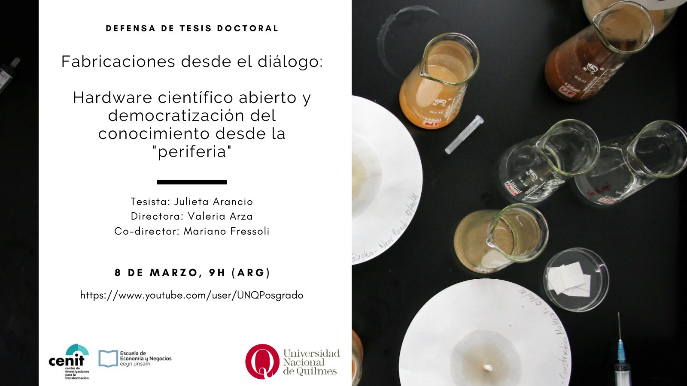

# Tesis doctoral
## Fabricaciones desde el diálogo: Hardware científico abierto y democratización de la producción de conocimiento en la 'periferia'

¡Hola! Mi nombre es [Julieta Arancio](https://julieta.aranc.io). Hice este repositorio y [página web](https://thessaly.github.io/phd) (inspirada en la web de la [tesis de Rayna Harris](https://www.raynamharris.com/Thesis/)) para dar a conocer mi trabajo doctoral de una forma más amable que leer un pdf de más de 300 páginas. 

Actualmente me encuentro realizando un postdoctorado en la Universidad de Bath y la Universidad de Drexel, financiado por la [Fundación Alfred P. Sloan](https://sloan.org/). El [proyecto (en inglés)]() busca identificar las condiciones bajo las cuales el hardware científico abierto en la academia es transformador, a través de un estudio del microscopio [Open Flexure](https://openflexure.org), para elaborar recomendaciones de políticas que fomenten estas iniciativas. 

## Sobre la tesis

La tesis se titula *"Fabricaciones desde el diálogo: Hardware científico abierto y democratización de la producción de conocimiento en la 'periferia'"*. Es parte de mi Doctorado en Ciencia y Tecnología de la [Universidad Nacional de Quilmes](https://unq.edu.ar/), Argentina. Está actualmente en proceso de ser publicada en el repositorio de la UNQ. 

Mi lugar de trabajo es el [Centro de Investigaciones para la Transformación (CENIT-UNSAM)](www.fund-cenit.org.ar/), al que pertenecen también mi directora Valeria Arza y co-director Mariano Fressoli. La tesis fue inicialmente financiada por una beca doctoral CONICET temas estratégicos (2016), a la que renuncié en 2019 por cuestiones personales. 

## Defensa de tesis

La defensa de la tesis se llevó a cabo el día 8 de marzo de 2021. Dada la pandemia de COVID-19 la defensa fue totalmente online, se puede ver en YouTube: [Defensa de tesis Julieta Arancio](https://www.youtube.com/watch?v=MzOi0bgDObQ).

## Slides

Las slides de la defensa están [disponibles en formato HTML](https://thessaly.github.io/defensa-tesis) (navegable con las flechas del teclado),

## Publicaciones relacionadas

- Arancio, Julieta. 2021. Opening Up The Tools For Doing Science: The Case Of The Global Open Science Hardware Movement. International Journal of Engineering, Social Justice, and Peace (en prensa).

Voy a ir actualizando esta página con más publicaciones, pero probablemente el lugar donde estén siempre actualizadas sea en [mi curriculum vitae](https://thessaly.github.io/curriculum/).

## Navegando esta página

La url de la tesis es https://thessaly.github.io/phd. 

Si estás viendo esto en una laptop, a la izquierda se encuentra el índice de contenidos, y dentro de cada sección vas a ver, a la derecha, la lista de sub-secciones. Si estás visitando esta web desde el teléfono podés acceder al índice desde el menú en la esquina superior derecha (las tres barritas).

## Contacto

¿Preguntas, sugerencias, comentarios? Podés contactarme a mi mail, [jarancio@unsam.edu.ar](mailto:jarancio@unsam.edu.ar) o a través de [mi cuenta en Twitter](https://twitter.com/cassandreces).

**Gracias por leer :)**
