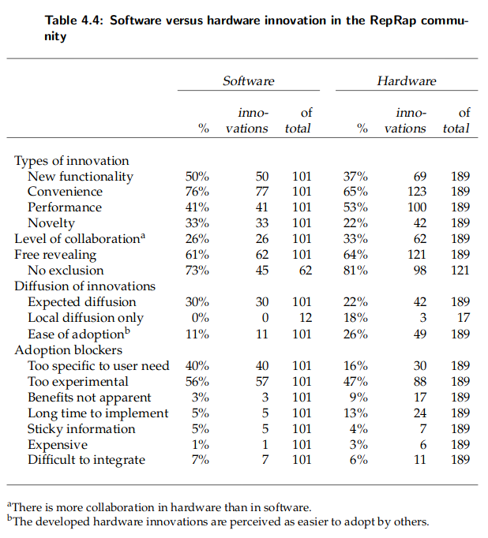

# On the viability of the Open Source Development model for the design of physical objects

## Motivations to participate

Unlike  producer-centered  innovation,  which  is  primarily  profit-driven,user innovation communities operate based on a wide range of motivations (von Hip-pel et al., 2010, p.  31).

### autonomy

In Self-Determination Theory (SDT), (Ryan and Deci, 2000, p. 71) cite autonomy as oneof three basic human needs, along with competence and relatedness.

The work done in open source communities usu-ally isn’t considered to be ”work” by the participants, since many of them participatevoluntarily.  

Dahlander and O’Mahony(2008) argue that progression can be achieved in project-based organizations that reward people with greater authority over collective work even though they do not gainauthority over other individuals (see also, e.g.,  Gacek et al., 2002, p. 9).

Falk et al. (2005) discuss the hidden costs of control, and conclude that closesupervision of workers can undermine intrinsic motivation.

Intrinsic motivators: Enjoyment can result from the pleasure fromlearning something new and gaining competence, or a sense of fulfillment results frombeing able to utilize their talent to solve challenging problems (von Hippel and vonKrogh, 2003). 

Conditional  payments,  but  also  career  incentivesand monitoring are examples of extrinsic stimuli. 
Amabile (1998, p.  79) states that extrinsic motivation is to be seen mostly as a poten-tial  source  of  creativity  problems.   

Because of the relative importance of activities that are enjoyed and the absence ofexternal stimuli, many members can be considered to be intrinsically motivated. 
This is consistent with recent findings of user innovation in the household sector, where 51%of the innovators’ expenditures were reported to be motivated by the enjoyment andlearning-related incentives (von Hippel et al., 2010, p.  31).

“As collaboration among far-flung individuals becomes more com-mon, the idea of doing things that require cooperation with others becomes much moreattainable, and the range of projects individuals can choose as their own therefore qual-itatively increases. The very fluidity and low commitment required of any given coop-erative relationship increases the range and diversity of cooperative relations peoplecan enter, and therefore of collaborative projects they can conceive of as open to them.” Benkler 2006

Autonomy,  according  to  Benkler  (Ibid.,  p.   21),  is  at  the  heart  of  a  shift  towardsdominance of individual and cooperative private action away from market-based andproprietary action.

### competence

Studies have shown that it is common in open source software projects that enjoyment-based  intrinsic  motivation  is  the  strongest  and  most  pervasive  driver  (Lakhani  andWolf,  2003).   Also,  intellectual  stimulation  and  gaining  competence  are  provided  astop motivators for participation.  

Lakhani and Wolf (2003) also note that in their sample of open source projects, aparticipants’ high rating of the creativity of their involvement was the strongest deter-minant of the number of hours that were weekly spent in the project. The multi-projectsample  revealed  that  the  sense  of  creativity  is  endogenous  to  the  people  within  theprojects, and not just a property of the project.

### relatedness

Kollock (1999, pp.  228-289) suggested that their attachment or commitment to a par-ticular open source project or group may motivate contributors’ actions (see also, e.g.,Lakhani, 2003; Muffatto, 2006, p. 61).

It is closely related to altruistic behavior that someobservers put forward as an important motivational drive (Hars and Ou, 2001). 

### meaning

Kollock  further  points  out  that  by  contributing  to  online  projects,  participants  get  asense of efficacy.   People can be motivated by the notion that contributions have aneffect on the environment.

Ariely  et  al.  (2008)  have  found  important  differences  in  the  levels  of  motivationbetween work that was perceived as meaningful and work that seemed meaningless.    

##  Motivations to collaborate

In collaborative dynamics, one can distinguish future oriented and reactive behaviors.

Future oriented: Forward-looking Social Approval Reward Hypothesis predicts that individuals will co-operate more when they have the potential to receive feedback on their own contribu-tions.

Reactive behavior is that when individuals can observe the degreeto which other participants are cooperating, it can stimulate a normative response toreciprocate by cooperating as well. (Cheshire, 2007)

The altruistic behavior that is commonlyseen in communities differentiates itself from patterns found in direct exchanges,  inthat the reciprocity is directed towards a group and not the individual.  
Recent empirical findings indicate that indirect reciprocity may becentral to what makes generalized exchange work (Mashima and Takahashi, 2008)

Replicability and non-rivalrous properties of the digital goods are im-portant for these selective incentives to have a more profound impact on motivation(Cheshire, 2007).  Replicability of digital goods, as pointed out before, is facilitated byour improved communications infrastructure.  Similarly, the fact that the informationis digital, the supply is not scarce since transferring digital goods to others does notdeplete the original stock.

## Methodology

Measures:

-  Community growth:  An attempt to measurethe size of the community is prone to be outdated when analysis of the collected data iscomplete. Yet, particularly over the long run, the precise size is far less important thanits growth rate.

-  The level of activity:  time and money spent on activities. Note  that  there  are  important  differences  between  thousands  of  peoplespending a few hours of their free time and smaller group that spends many hours permonth as part of their jobs 

-   Innovation in software versus hardware: One would expect a higher geographic concentrationwhen it concerns a hardware modification. While this may be the case, it did not limitthe level of collaboration severely, as there is more collaboration in the hardware thansoftware even when adjusting for the high hardware-to-software ratio (ain table 4.4).This can only partly be explained by slightly higher levels of free revealing in hardware– 121, or 64% – compared to software – 62, or 61%.

-  Utilization  of  open  source  hardware  development  infrastruc-ture: use of platforms, proportion of derivatives, degree of documentation

-  Collaborative behavior: how much people help others

- The role of local communities: this is an indication that both software and hardware related problem-solving ac-tivities do not require on the presence of local groups. Still, successful problem-solvingin hardware is facilitated by being in a local group of RepRap users.

## Conclusions

I  conclude  that  opensource physical production of goods is facilitated by three major factors.  

### 1. An individual participant’s low fixed and incremental costs to design and physical production.  

The tools required for software production are widely available and cheap, as pointedout, among others, by Lakhani and Panetta (2007, p.  106).

The design process for physical objects is increasingly digitized, thanks to increas-ingly powerful and affordable computer aided design (CAD) software and digital fab-rication equipment such as the RepRap machine. 
This results in further codification ofdesigns and lower transaction costs for replicating the results and sharing the work-load. 
A web page with some CAD-files and instructions can suffice to enable others toreplicate a result and build on it.  
It is important to note that the cost of replicating theinnovation is not incurred by the person sharing it, but rather by the one that wishes toreplicate it.

Those who replicate a physical innovation from the digital design files will alwaysincur a certain material cost.  Yet, compared to the scenario where one also has to de-velop the design, it can be significantly time-saving to adopt pre-existing designs. Also,an existing design might already be tested by its developer and/or others.

Collectively, potential users of an innovation already hold critical knowledge assetsfor the creation of innovations, because of their access to need-related and context-of-use information (Shah, 2005). Another major component is solution knowledge, whichcan be acquired through trial-and-error experimentation and which can be shared in acommunity (as demonstrated by Wikipedia).  Consequently, in many cases this meansthat together they can innovate at a low cost.  

**Cost of prototyping**     
Physical prototyping requires an investment in physical resources, some of which arefixed costs, others incremental, such as costs per design iteration.  

Resources that areoccasionally needed and that have a long life-time are candidates for sharing, exam-ples are workspaces, power tools and digital fabrication equipment. 
Materials may beused once per iteration or reused.   
To the extent to which customized parts cannotbe recovered or recycled for further prototyping iterations these are unavoidable costs.
The amount of unrecoverable parts can be reduced through design architecture anda distributed search for ubiquitous low-cost parts. 

Assembly time is often at odds withmodularization, so in some cases the use of unrecoverable custom parts can be a delib-erate choice in order to reduce assembly time, which is another major input to manu-facturing costs.  
Computer driven production technologies and especially 3D printing are well suited for part consolidation. 
While parts can be physically consolidated, theycan still be produced based on a modular architecture in the CAD software.  
With re-spect to the design they are still modular,  but assembly is still facilitated because ofintegrated assemblies. 
This somewhat relaxes the tension between modularization andintegration. 
Moreover, complex, fully functional assemblies, such as a clock with gearsand a pendulum, can be 3D printed in one go without requiring any human assemblyor intervention (Gibson et al., 2010).

The availability of lower-cost manufacturing tools and services allow a much widerset of people to innovate.
The rapid growth of the installed base of open source 3D printers lowers the barrier for people to innovate.

  Thomke(1998) says that simulation is beneficial to R&D because developers can increase thediversity and frequency of problem-solving cycles while reducing the total amount oftime  and  money  spent  on  R&D.  3D  printing,  which  is  called  Rapid  Prototyping  forexactly this reason, is beneficial in exactly the same way.
  
Still,  physical prototyping results in inevitable costs associated with material ex-penditure  as  mentioned  in  section  5.1.1.    In  addition,  a  tangible  result  may  be  re-quired  to  keep  motivation  high.   Seeing  a  partially  working  prototype  can  be  veryexciting through a sense of achievement and comforting because private benefit maybe achieved and time is well spent6.  This achievement can be shared at relatively lowcommunication costs (posting a picture or Youtube movie). The revealed successes mayhelp create momentum for further development by others. 

2. Sufficient incentives that justify incurring said costs, if applicable.

Given the voluntary nature of the majority of the contributions, incentives other thanmonetary compensation are dominant.  59% of contributors to open source softwareprojects sampled by Lakhani and Wolf (2003) report that use of the output they cre-ate is one of the three most important incentives inducing them to innovate.

User innovators don’t need to start from scratch (von Hippel, 2001, p. 82). The taskgranularity determines the various sizes of tasks available to individuals with a variedlevel of ambition. One of the smaller tasks is bug fixing. The major incentive for a userto fixing or reporting a bug is that it improves his and other users’ satisfaction with theproduct.  The private benefits may be enough to justify the effort, the social benefits(praise, reputation) further justify incurring the effort to freely reveal the modification.

Better integration of the fix in future versions made by others are another reason for free revealing. 
This, however, is a double-edged sword: Intrinsic value of participationis at risk when there’s a failure of integration of one’s work into the project (Benkler,2002)
 
3. Oen collaboration as a means to spread the workload and have access to themuch larger collective assets that help achieve the individual goals

Modularity enables multipleparticipants to work on separate modules independently and allows more rapid inno-vation by recombining modules in different ways. 

It is often more efficient to carry out several prototyping iterations in one physical loca-tion rather than having many disparate people each doing a single iteration.  Possiblereasons for this are access to physical resources that are tied to a fixed location and theconcept of sticky information – the cost of transferring information from one locus toanother (von Hippel, 1995). 

A reduced dependence on local resources increases the poten-tial for a project to elicit contributions from a more dispersed audience.  This audiencehas a higher average physical proximity, but potentially a much lower social proximity.

Breschi and Lissoni (2001); Jeppesen and Lakhani (2010) argue that this social proxim-ity has a significant impact on collaboration and knowledge exchange. Boudreau et al.(2008) emphasize that a “parallel search effect” benefits innovation by broadening thesearch for solutions,  which is especially important for complex problems where justexerting high effort is not enough because these problems implicate multiple knowl-edge sets.

Drivers that enable lower-cost coordination and information sharing include ded-icated  infrastructure  that  is  built  for  this  purpose,  such  as  Thingiverse,  and  generalpurpose infrastructure such as wiki’s and video sharing platforms. Hence, the develop-ment of infrastructure by participants and stakeholders in and around the communityis driven, in part, by both endogenous and exogenous trends. It is reasonable to expectthat technically, the sharing of physical innovations and its accompanying informationwill only become easier and can over time be done at a lower cost.
