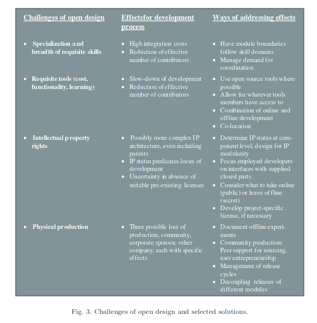

# PRODUCT DEVELOPMENT IN OPEN DESIGNCOMMUNITIES: A PROCESS PERSPECTIVE

Discussion focusses on different aspects of modularity as well as the availability of low-cost tools.

## Literature on open innovation process

Developers belong to either thecore, i.e. the project leader andthe code maintainers, or the periphery, a much larger group of developers. 
Core developers rely on theperipheryto create code patches and report bugs, to testsuggested solutions and to provide critical feedback. 
Core developers decide whichof the code sections thus developed are incorporated in the next official release[Rullani (2007)].

They have lately begun to exert more rigorous guidance andprojectmanagement, due to the “increasingly commercial nature of OSS” and the needto create a high-quality and professional product [Fitzgerald (2006, p. 591)]. 
In this regard, they have adopted practices of traditional software companies [Due ̃naset al.(2007)]. 

Product development is organized as anevolutionary  learning processthat isdriven by criticism and error correction and institutionalized as peer review. 
Stable versions of the source code co-exist with experimental versions that exhibit a hostof new features, but lower reliability. 
“The experimental tree is where innovativevariations and experimentations are generated, tested, and selected to become apart of the stable tree where further refinement and improvement are conducted”[Lee and Cole (2003, p. 640)].

Software releasesare the landmarks in a cyclical process of continuous devel-opment [Ruhe and Saliu (2005)]. 
Each release of a new version sets in motion anew development cycle. 
The dual structureof experimental releases that encouragenovel features, peer review, and improvement cycles and stable releases that safe-guard the usage of a reliable product parallelize exploration and exploitation [Leeand Cole (2003)]. 
Production and diffusion are virtually costless, facilitating shortrelease cycles [Von Hippel and Von Krogh (2003)].

## Physical designs characteristics

[Abdelkafiet  al.(2009) provide an overview]. 

Four aspects have beensuggested to carry particular weight:

- Skill requirements: While software co-development mainly requires competen-cies in computer science, the nature of physical objects may necessitate a greaterbreadth of domain knowledge [Lerner and Tirole (2005)]. The integration of thisheterogeneous knowledge can be challenging, carrying significant costs of integrationand coordination.

- Tools: the development of physical products is likely to require other, potentiallydomain-specific tools that may not be easily accessible to all community members.Still, the availability and quality of tools supporting design work and related inter-actions is likely to impact on and constrain process organization, e.g. the sharingand coordination of work packages [Zammutoet al.(2007)].

- Intellectual  property  rights(IPR): Whilemany individual actors freely donate their time and effort, access to machinery andother production equipment coupled with economies of scale is likely to call for acorporate investor. Such an investor would typically seek to minimize her financialrisk, specifically by trying to assure at least partial value capture by means of asupportive IP architecture.

- Production: Unlike in digital space, development, production, and distributionare clearly distinct in open design and the actors driving each of these stages donot need to be identical [Abdelkafiet al.(2009)]. According to von Hippel and vonKrogh [2003, p. 219], “[i]n the case of innovations embodied in physical products, onewould expect that while users would innovate, general diffusion would require theinvolvement of manufacturers. This is because physical products must be producedand physically distributed.”

## The open design process

### Isomorphism between OSS projects and open design projects

- As in OSS development, all but  one of our cases relies on anopen  license
- Control is low inasmuch as contributors are not obliged to perform any task.
- In all projects, there is adistinction between thecore and the periphery,associ-ated with different roles in the project.
- Like many OSS projects [Lee and Cole (2003)], processes are structured by the duality of astable release and a more experimental successor.
- They exhibit “hands-on development,” i.e. testing andimprovement of an existing physical prototype, by the community, in analogy to OSS.

### Differences due to skills

The greater is this diversity of skills required, the more difficult the coordination among the differ-ent work-streams seems to become. 
Integration costs increase, usually located withthe project coordinator and possibly the core team.

To be able to maintain coordination, the leaders in three of our four projects strive to limit the number of active contributors, e.g. by declining offers of developmentsupport or by actively restricting the number of core developers. 
Thus they seek to match the demand for coordination created by developers with their own resourcecapacities (in volunteer set-ups specifically time restrictions).

Another solution adopted  in  some of our cases is  to attempt to  fit module boundaries to skill domains. 
Having module boundaries go between components that require different skill sets reduces integration costs within modules.

### Differences due to tools

The issue of tool support that is often mentioned in relation to open design [Han-cock (2008)] can be broken down into three problems

a) the available tools may be expensive for hobbyist volunteer develop-ers; 

Use of open source tools. 

b) second, they may not provide the required functionality; 

Insufficient tool functionality (e.g. not supporting collaboration) slowed down development progress and reduced the number of developers who could effec-tively be involved. 

c) third, they may require substantial investment in learning how to use them.

Earning to master sophisticated CAD tools was found to be hard forvolunteers working part-time on the project. It can be surmised that this investmentdeterred some hobbyists from participating in development and thus reduced thenumber of developers involved.

### Differences due to IP

The institutional foundations defining and pro-tecting IPR in open design projects can be more elaborate than in OSS devel-opment, resembling a patchwork of widely different pieces. 
Unless the communityself-produces the open design, it is clear that the manufacturers’ requirements forvalue capture will need to be accommodated if the community is ever to hold itsdesigned products in hand.

For the development process, this implies that some parts of the product archi-tecture remain black boxes for community developers, limiting or even preventingmodification.

### Differences due to physical production

RepRap community takes care to choose components that are stan-dard parts obtainable in home building or electronics stores. 
This reduces variation among different machines and facilitates self-assembly. 
Still, developers are left withmany sourcing and assembly issues.
In answer to these challengesthat appeared hard to solve in digital, delocalized space, local sub-groups haveemerged.

Experimentation mostly takes place offline and is thus invisible to thecommunity. Ex-post effort is then required for knowledge sharing by documentingexperiment set-ups and outcomes.
Especially for failed experiments, this effort may appear unnecessarily tedious.As a consequence, it can be surmised that peer review is sometimes replaced byindividual selection processes. 

Our cases support the implication by vonHippel and von Krogh [2003] that short release cycles are rendered difficult whenproduction and diffusion are not virtually costless. Both cases point to the differ-entiation of module- or component-level release strategies as a potential solution.Modularity helps to update one part of the system while keeping the other stable.

## Conclusions

### The power of modularity in open design

Modularity enables the design of tailor-made IP architectures, the integration of a great breadth of skill domains, and the decouplingof release schedules of different sub-systems.

### The sequencing of online and offline

Our cases have shown that open design processes often include online as well asoffline communication during product development. They revealed that this mixtureis partly due to the identified challenges, particularly inadequate tool support, thedesire for secrecy within an open IP architecture, and the role of hands-on (offline)testing and development.

We encoun-tered offline-online-offline processes as well as online-offline-online processes. Thissequencing can be intentional or emergent.

The  primary  enabler  of  open  design  is  that  the  requisite  tools  areavailable to support development, web-based (and possibly also offline) knowledgeexchange, and data management.

