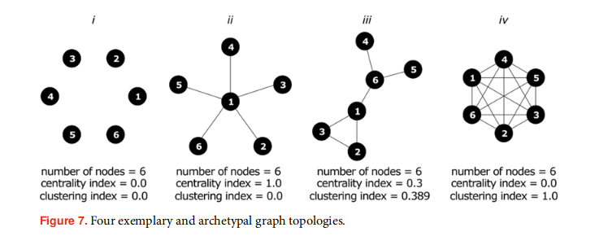

# How participative is open sourcehardware? Insights from online repository mining

n the public narrative, transparency and free disclosure of product-relatedinformation goes along with participative, democratic, community-based formsof development where any interested person can involve, regardless of theirgeographical or organizational background. As noted by Raasch & Herstatt(2011), while ‘the termopen sourceprimarily relates to the type of licence underwhich [products are] made available, it has also been used to describe specificpatterns of product development processes’.

But previous research highlighted the difficult settlement of participative development practicesin OSH – few development projects being successful in creating the necessarymomentum for maintaining stable community-based product developmentprocesses (Bonvoisinet al.2017b). 

Some authors highlighted higher barriers to opensource development in hardware than in software, especially due to prototypingcosts (e.g., Müller-Seitz & Reger 2010; Raasch & Herstatt 2011).

**Question:** Is the community-based development of these products is a romantic projection or an observable phenomenon??? Which share of OSH products is the object of an OSPD process?

**Method**: mining of version control repositories

## Community-based product development in OSH

Scientific and popular literature has referred to subfields of the 'open' with competing terms, occasionally leadingto confusions (Ehls 2015; Murillo 2017).

Two kinds of community-based product development processes in OSH can be distinguished (not mutually exclusive and combine into composite forms):

- peer-to-peer development where products are designedand produced by individuals working **sequentially** (observed by Özkil (2017) and Kyriakou, Nickerson & Sabnis(2017) on the CAD model sharing platform Thingiverse)

These are collaborative in the sense that designs are generated by the action of more than one person, these are not collaborative in the sense of coordinated action of people with common objectives. 

‘Designers get inspired by each other’(Özkil 2017) and ‘build on top of each other’s work’ in an evolutionary process where each representative of the species is a design created by one designer. 
This form of community-based design is often associated with low complexity designs, such as DIY and 3D-printed products, though similar processes may also be involved in the development of variants of more complex products, as observed in the case of the electronic board Arduino Duemilanove (Mellis & Buechley 2012).
    
- Collective design and is where productdevelopment is performed by coordinated action of individuals working inparallel (Paulini, Murty & Maher 2013). 

Applies to complex (multi architectural elements) products, where there is a combination of technologies, greater number of parts and requirements.

Product development is expected to resemble an ongoing process of continuous product improvement supported by a community of interested people (Geyeret al.2012).

## Open innovation field and the open source product development

**Open Source Innovation** (Raasch, Herstatt & Balka 2009) is the ‘free revealing of information on a new design with the intention of collaborative development of a single designor a limited number of related designs for market or nonmarket exploitation’. 
 
**Open Collaboration** (Forte & Lampe, 2013) is ‘an online environment that (a) supports the collective production of an artefact (b) through a technologically mediated collaboration platform (c) that presents a low barrier to entry and exit and (d) supports the emergence of persistent but malleable social structures'

--ATTENTION! # of collaborators as metric of success!?--     
The transparency of a product development project is therefore an indicator of the intention to gather voluntary participants, where the number of involved people may be an indicator of success in pursuing this intention.

**Open Design** (Raaschet al.2009; Howardet al.2012; Aitamurtoet al.2015; Brulé & Valentin 2016;Ostuzziet al.2016) has  similar definitions in the literature that are however not fully consistent with each other and partly refer to other forms of open innovation.

Other authors used the terms **open source development** or **open source design** in a meaning which is close to the definition given to OSPD in this paper (Buitenhuis& Pearce 2012; Fjeldstedet al.2012; Zhang & Li 2017).

OSPD also differs from what Huizingh (2011) calls **public innovation** and Boisseauet al.(2018) call **downloadable design**, and which is characterized by the free revealing of product-related information at the end of a closed product development process.

## Evidence of OSPD

In contrastwith the large number of academic articles referring to community-basedproduct development practices, few empirical evidences of such practices havebeen delivered throughout the scientific literature.

- Question 1: Transparency of development process
- Question 2: How does the observable development activity distributes among different contributors? How many people and their relations.

Platforms:  GitHub, Phabricator,GitLab, and BitBucket.

In studies of FOSS repositories, a similarity with small-world networks has been confirmed (e.g.,Lopez-Fernandez, Robles & Gonzalez-Barahona 2004).
These are networks where members maintain an average low number ofconnections but benefit from indirect access to all other members. 
They describe rather decentral, efficient and robust organizations, containing a few highly connected nodes playing the role of hub.

Xuet al.(2006) pointed out another interesting characteristic of FOSS projects, their ability to scale up. 
While the majority fail in attracting alively community of contributors, some of them succeed in gathering thousands of participants – a much larger base than any closed software development projects could reach.

**Interesting methodology of social network analysis to study community-developed hardware**

## Metrics developed

### RQ1: Volume of observable design activity

- **file change**: any occurrence of a change brought to a file and recorded by a commit.

### RQ2: Distribution of design activity
- **Distribution of design activity**: the reference unit of observable collaboration is the edition of the same file by two contributors

Besides # of collaborators, this gives:
- centrality index:  variation in the relative importance ofall nodes in a graph. 

This corresponds to the degree to which interactions are centralized towards a few people or are distributed evenlythrough all contributors. We use here the degree centrality, where the importance of a node equals to its degree, that is, the number of edges itis connected to.

- clustering index: degree to which nodes tend to clustertogether. 

This corresponds to the degree to which contributors tend to cluster in subgroups of three or more people directly working on thesame files.

It tells ‘how many of a member’s collaborators are collaboratorswith each other’ (Xuet al.2006)

**Four possible types emerging:**

(i) Graph i has no edges. Consequently, centrality and clustering indexes are zero. This means all contributors work strictly in parallel, working with their own sets of files. This does not mean there is no collaboration in the sense of coordinated parallel effort, though.

(ii) The centrality index of graph ii is maximum, meaning that one person inthe team collaborates with all other contributors, which do not collaborate together. This typical star graph topology indicates that contributors tend to work separately from each other and to be coordinated by a unique centralmember.

(iii) Graph iii shows low to average centrality index and a non-zero clustering index. This indicates a rather loose coupling of activities which may be modularized in more specialized and closely connected sub-teams.

(iv) Graph iv is complete, which is reflected by a maximum clustering index. This means all contributors collaborate with all other contributors.

## Results

- Volume of observable design activity

The number of file changes permonth is visibly unstable, indicating a high variability in the volume of work performed in these projects over time. 
The average value of the number of file changes per month grows until 2017 and decreases afterwards. 

Roughly one third of all editions affectCAD files, one third probably hardware-related documentation and another one third other unidentified files of software files.

While some projects show intense observable development activity, some others host activity that is either less intensive or not captured in GitHub.

- Distribution of design activity

The average number ofcontributors per project is 7.26 with a maximum value of 79. 

14% (15/105) of all projects are individual projects, meaning thereis only one person contributing to all file changes. 

33% (35/105) of all projectshave only one person contributing to the edition of CAD files. Here the eventual collaborative activity happening is not captured on GitHub. 

**The four identified clusters can be interpreted as four project types; clustering applied to the file co-edition network:**

- (i) Cluster 0: Closely connected decentral networks with connected sub-teams. Their average number of contributors is high with a high variance. The medium centrality and clustering indexes indicate there are numerous links between contributors and no clearly defined central node.

- (ii) Cluster 1: Individual projects or projects involving a low number of people working in parallel. Almost all indicators are low, the average number of nodes is less than two, and there are hardly links between the nodes.

- (iii) Cluster 2: Highly centralized projects, with a low to average number of contributors and some outliers having higher numbers of contributors. The high centrality index and the low clustering index indicates that the network tends to be star-shaped, meaning that all works are reviewed, overtaken by or taken from the same ‘gatekeeper’.

- (iv) Cluster 3: Loosely connected decentral networks with disconnected sub-teams or isolated contributors. The number of contributors is medium to low with a low variance. The average centrality index and low clustering indexes indicate there are some small star shaped sub-teams.

Projects of cluster C1, which represents 33% (35/105) of all projects, hardly showevidence of collaborative work. These projects may have opted for a limitedopenness to participation of external people or may experience difficulties inrecruiting participants. 

On the contrary, projects of clusters C0, C2 and C3, which represent 66% (70/105) of all projects,show concrete evidence of distributed collaborative work and can be thereforequalified as OSPD projects. 

**Same clustering method applied to thecontributor interactions on CAD files only:**

In this new case, the share of projects showing clear evidence of collaborative workand qualifying as OSPD has decreased. 

Clusters C0 and C3 gather projects with adecentral structure and represent 25% (26/105) of the dataset. 
These categories do not only shrink in number of projects but also in average number of contributors per project. 

On the contrary, the share of projects showing little evidence collaborative activity increase in this case. 

## Discussion

Concerning RQ1, a significant shareof the 105 considered OSH products show histories of numerous visible fileeditions. This indicates the presence of product development activity happeningin transparent processes along which product-related data is publicly accessible.

RQ2, the results showed clear evidence of distributeddevelopment activity happening in two thirds of the considered OSH projects.A significant share of projects show a decentralized structure. Different forms ofinternal organization could be observed, from star-shaped central organization todecentral networks of closely or loosely integrated sub-teams. 30% of all projectsreproduced the small-world network topology previously observed in OSSD.

These results confirm the heterogeneity of practices in open source hardware previously observed by the authors (Bonvoisinet al.2016), who hypothesized that the development of OSH tends to fill a continuum between OSPD defined here and public innovation (Bonvoisin et al.2017a). 
Alternatively, this heterogeneitymay corroborate the observations made by Özkil (2017) in the context of simplerproducts. They identified in a large population of designs a low number ofreally successful and collaborative projects and a large number of ‘infertile’ and‘dormant’ designs.

While the data shows how distributed theproduct development effort is, it reveals neither the geographical dispersion ofcontributors nor their respective social relations.

While 61% of all projects could be classified as OSPDwhile considering all file changes, only 19% could be considered as such whileconsidering only CAD files. 
This tends to indicate either that the contributorsworking with CAD tend to work in smaller teams or alone or that GitHubdoes not capture this activity. 
This last hypothesis is probable as GitHub hasnot been originally developed for hardware development and may not providethe necessary PDM features to support collaboration on CAD files.

When compared to FOSS, OSH still faces the challenge to matureand switch from a ‘hobbyist’ participation model and to a ‘professional’ one, touse categories given by Malinenet al.(2010). **Is this indication of a more local phenomena?**

The results presented in this paper tendto show an increase in the activity volume between 2012 and 2018, which allowprognosticating an increased relevance of this new form of product developmentin the future years.

## Further research

**On methodology**: refine the unit of collaboration (file change) by the volume of data affected (and depending on file type)

Considering the edition of a common file as a mark of collaboration implies a very conservative assessment of collaboration patterns. 
Furtherworks may seek to consider data reflecting the different ways to engage in an OSPD project.

The topologicalindicators are only based on theexistenceof links between contributors, but nottheirrelative importance, which may deliver a distorted view of the interactionshappening in these projects.

