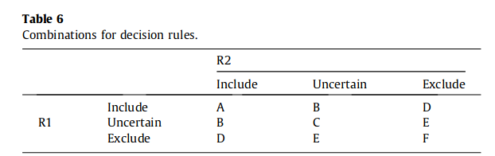

# Guidelines for conducting systematic mapping studies in softwareengineering: An update

A systematic mapping study and a systematic literature review share some commonali-ties (e.g. with respect to searching and study selection), they aredifferent in terms of goals and thus approaches to data analysis.While systematic reviews aim at synthesizing evidence, also con-sidering the strength of evidence, systematic maps are primarilyconcerned with structuring a research area.

The research questions in mapping studies are general as theyaim to discover research trends (e.g. publication trends over time,topics covered in the literature). On the other hand, systematicreviews aim at aggregating evidence and hence a very specific goalhas to be formulated (e.g. whether an intervention is practicallyuseful by industry). Wohlin et al. argue for achieving a good samplewith respect to the characteristics of the population the reviewersare aware of.

Quality assessment is more essential in systematic reviews todetermine the rigor and relevance of the primary studies. In sys-tematic maps no quality assessment needs to be performed. Using the classification of research types by Wieringa et al.[11] a category of solution proposals would contain articles with noempirical evidence.  Articles in this category would generally notbe included in a systematic review, though in systematic mapsthey are important to spot trends of topics being worked on.

The outcome of a mapping study is an inventory of papers onthe topic area, mapped to a classification[11]. Hence, a mappingstudy provides an overview of the scope of the area, and allowsto discover research gaps and trends.

## Benefits
Petersen et al.[2]proposed that a mapping study preceding asystematic review provides a valuable baseline. Kitchenham et al.[9,16]evaluated whether systematic maps are in fact useful asinput for follow-up studies. The type of study conducted was a par-ticipant-observer case study. In the study, multiple benefits havebeen observed, namely: time-savings for follow-up studies (e.g.due to reuse of study protocols); good overview of an area andthe ability to identify research gaps; visualization of researchtrends; related work identification; use as a validation set basedon gathered references; educational source. Kitchenham et al.[9,16]also pointed out that it is important to have a well definedand reliable classification scheme.

## Validity

### Descriptive validity
Descriptive validity is the extent to which observations aredescribed accurately and objectively. Threats to descriptive valid-ity are generally greater in qualitative studies than they are inquantitative studies. To reduce this threat, a data collection formhas been designed to support the recording of data. The formobjectified the data extraction process and could always be revis-ited, as was the case for the primary studies.

### Theoretical validity
- Study identification/sampling:During the search studies couldhave been missed, as pointed out by Wohlin et al.[7]two mappingstudies of the same topic ended up with different sets of articles. Toreduce this threat, we complemented the search with backwardsnowball sampling[19]of all studies after full-text reading 

- Researcher biases may appear during the selection and extrac-tion of data. The study selection was conducted by an individualauthor, which is the main threat to validity. 

- Data  extraction  and  classification:During  this  phaseresearcher bias is also a threat. Kitchenham et al.[30]as well asBrereton et al.[31]found it useful to have one researcher extractthe data and another reviewing the extraction. To reduce the bias,the first reviewer assessed all extractions made by the secondreviewer. Though, given that this step involves human judgment,the threat cannot be eliminated.

### Interpretive validity
Interpretive validity is achieved when the conclusions drawnare reasonable given the data, and hence maps to conclusion valid-ity. A threat in interpreting the data is researcher bias. The firstauthor is a co-author on one of the guidelines[2], which may bea bias in interpretation. On the other hand, the experience withsystematic review processes may also help in the interpretationof data.

### Repeatability
The repeatability requires detailed reporting of the researchprocess. We reported the systematic mapping process followed,and also elaborated on actions taken to reduce possible threatsto validity. Repeatability was also aided by the use of existingguidelines.

## Results

- Frequency of publication
- Topics covered: Either a new classification is created, emerging from the papers being studied, or an existing classification is used (from SWEBOK or standards e.g. IEEE orISO/IEC). In most cases a new classification is created following the strategy of identifying clusters based on keywords
- Venues of publication: type ofpublication venue (e.g. journal, conference, and workshop) as wellas the concrete venues being targeted
- contribution type: type of intervention being studied, this could be a process, method,model, tool, or metric
- study type:  evalua-tion research, validation research, solution proposal, philosophicalpaper, experience report, and opinion paper
- study focus:  academic, industrial, govern-ment, project, and organization context
- research method: case study, experiment, orsurvey

## Guidelines

1. Planning the mapping 

**1.1 Need identification and scoping**     
Mapping ques-tions are about what we are knowing with respect to a specified topic. Typically also questions regarding venues, researchmethods, and trends are included. A number of typical research goals for mapping studies wereidentified by Arksey and O’Malley, namely:

- ‘‘To examine the extent, range and nature of research activity’’
- ‘‘To determine the value of undertaking a full systematic review’’
- ‘‘To  summarize  and  disseminate  research  findings’’
- ‘‘To identify research gaps in the existing literature’’

Example:

‘‘What Do We Know about Software Product Management?’’Often those high level questions have to be further brokendown to drive the data extraction:

–‘‘What research questions in software product management arebeing addressed?’’
–‘‘What original research exists in the intersection of softwareproduct management and cloud (service) environment?’’
-‘‘What areas in software product management require moreresearch?’’

**1.2 Study identification**     
In systematic reviews the goal is an exhaustive search where we identify all the relevant evidence[18]. Based on previous evalua-tions for mapping studies there is an indication that this may notbe a realistic goal[7,14]. Wohlin et al.[7]state that having more papers is not necessarily better than having fewer, it depends on whether the papers are a good representation of the population.

The following questions may help in gain-ing some initial insights about the population:    
- Are different a priori known sub-areas of the field covered? Here, existing classifications of the field may help, as well as experts who may point to classifications or could draw up a map of areas they believe are of relevance
- Are the main publication forums specific to this area (e.g.conferences), or general software engineering forums (e.g.journals), represented when identifying relevant articles?
- Are there explanations for major changes in the number of stud-ies published per year? For example, this may point to newareas that should be added to classifications established earlier.

Strategies include snowballing, manual search and database search. Evidence has shown that manual searches are beneficial, and even be more effective in identifying relevant studies[8]. With respect to snowball sampling, a recent study found that in the particular context studied, all relevant studies identified by the search could also be obtained by snowball sampling[61]. The key for success is to define a good startset.

Advice:     
- Choose articles from different clusters (e.g. communities) thatare not likely to cite each other, and hence cannot be foundthrough citation relationships. They should of course be rele-vant for the research question.
- The number of articles in the start set should not be too small,the size depending on the focus and size of the area, which may not be known beforehand.
- Different authors, years of publication, and also publishers should be covered. For example, when choosing the sameauthors, these are likely to know about their own work, andhence may limit the breadth of the search.
- Keywords from the research question should be the base for formulating the start set, and are essential when searching forthe initial set of papers to start the snowballing from.

a) Developing the search:

- PICO, focused on population and intervention.
- The approaches identified (consult experts, iteratively improvethe search, identify keywords from known papers, and use stan-dards, encyclopedias, and thesaurus, seeTable 5andFig. 7) arenot highly time intensive and may greatly improve the quality ofthe search.

When searching the databases, one has to select databases ofinterest. As recommended by Dyba et al.[17]and Kitchenhamand Brereton[8]the use if IEEE and ACM as well as two indexingdatabases (e.g. Inspec/Compendex and Scopus) is sufficient.

When defining the search string based on the research ques-tions and PICO(C) one also has to consider precision and noise. Ifa search returns a very large number of irrelevant hits, it may beuseful to reflect on whether to further restrict the search.

b) Evaluate the search:

Utilizing a test-set of known papers was the mostcommon one. This can, for example, be done by asking an expert inthe area who should provide a set of ten papers that should be found. After the search, it may also be useful to have an expert evaluate the search result.

As the population is unknown when searching, Petticrew andRoberts[18] make the practical suggestion to define a stoppage cri-terion for the search. For example, if we are using database search and a complementary search approach (such as manual search, snowball sampling) does not add a specific number of new articles to the database search then no further searching is done.

c) Inclusion and exclusion:

The inclusion and exclusion cri-teria may refer to (a) the relevance of the topic of the article, (b) the venue of publication, (c) the time period considered, (d) require-ments on evaluation, and (e) restrictions with respect to language

In the case of systematic maps (d) should be avoided toalso see recent trends that have not reached the maturity for evaluation yet.

First, the selection criteria are specified from the review protocol, and are reviewed among the researchers. Thereafter, Ali and Petersen[65] propose to use a think-aloud protocol where one reviewer describes the thought process of inclusion/exclusion by applying  them  to  one  study,  which  aligns  understanding. Thereafter, the reviewers pilot the criteria and determine the level of agreement. Each of these steps may lead to an update of the criteria. Thereafter, the selection is performed on titles and abstracts first. Each researcher evaluates the primary study with either ‘‘in-clude’’, ‘‘exclude’’, or ‘‘uncertain’’.

For two reviewers (R1 and R2) the following combinations areobtained (seeTable 6), and can be used for decision rules.Decision rules have only been utilized by very few studies, buthave been found empirically useful to decide on whether to takea paper to the next stage in the review (e.g. reading introductionand conclusion due to an unclear abstract, or reading the full-text).

The most inclusive strategy is to take all articles (A–E) to the next step andonly exclude F right away. As has been shown in the study[65]fol-lowing the most inclusive strategy (A + B + C + D + E) would find allrelevant studies, but also has 25% more overhead to strategy(A + B + C + D), where 94% of all studies were identified. Overheadis defined as the‘‘percentage of irrelevant articles that had to be ana-lyzed’’

d) Quality assessment: 

Quality assessment should not pose high requirements on the pri-mary studies as the goal of mapping is to give a broad overview ofthe topic area
