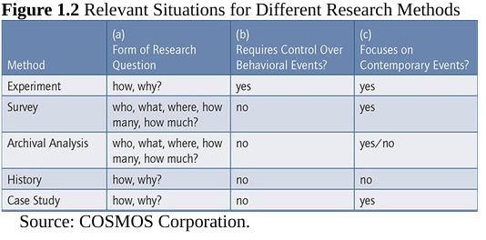
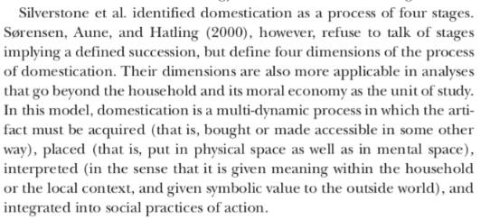
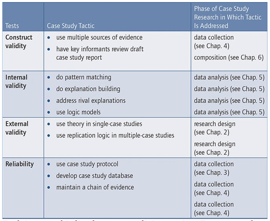
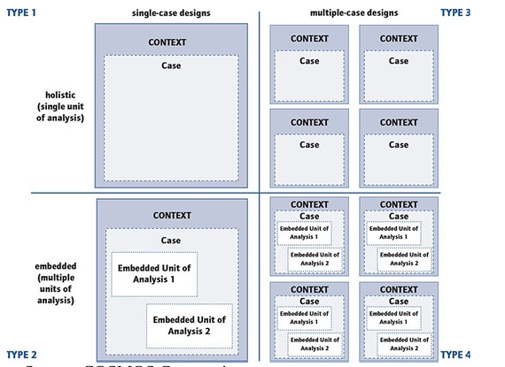
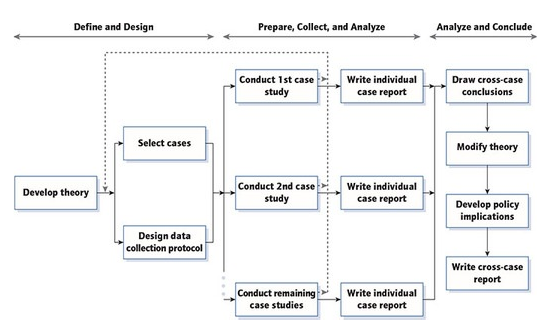

# Chapter 1 - Why choosing a case study method

- The more that your questions seek to explain some contemporary circumstance (e.g., “how” or “why” some social phenomenon works), the more that case study research will be relevant.

- Case studies also are relevant the more that your questions require an extensive and “in-depth” description of some social phenomenon.

Some examples of case studies in sociology:
- Feagin, Orum & Sjoberg, 1991
- Hamel, 1992
- Michell, 1983
- Platt, 1992

## When to Use the Different Methods

The three conditions consist of: 

*(a) the form of research question posed:*

The first and most important condition for differentiating among the five social science research methods is to classify the form of the research question being asked.

"How” and “why” questions are more explanatory and likely to lead to the use of a case study, history, or experiment as the preferred research method. This is because such questions deal with the tracing of operational
processes over time, rather than mere frequencies or incidence.

*(b) the control a researcher has over actual behavioral events:*

Experiments call for an investigator to manipulate behavior directly, precisely, and systematically.

*(c) the degree of focus on contemporary as opposed to entirely historical events:*

A more contemporary version of historical research can study the recent but not quite “dead” past, as in conducting an oral history (e.g., Janesick, 2010). In this situation, historical research begins to overlap with case study research.

The case study relies on many of the same techniques as in a history, but it also relies heavily on two sources of evidence not usually available as part of the conventional historian’s repertoire: direct observation of the events being studied and interviews of the persons who may still be involved in those events.

Although case studies and histories can overlap, the case study’s unique strength is its ability to deal with a full variety of evidence—documents, artifacts, interviews, and direct observations, as well as participant-observation —beyond what might be available in a conventional historical study.

## Definition of the Case Study as a Research Method

A twofold definition—covering the scope and features of a case study—shows how case study research comprises an all-encompassing mode of inquiry, with its own logic of design, data collection techniques, and specific
approaches to data analysis.

1. A case study is an empirical method that investigates a contemporary phenomenon (the “case”) in depth and within its real-world context, especially when the boundaries between phenomenon and context may not be clearly
evident.

Experimental research deliberately separates a phenomenon from its context, attending only to the phenomenon of interest (usually as represented by a few variables). Typically, experiments ignore the context by “controlling” it in a laboratory environment. 

Historical research, by comparison, does deal with the entangled situation between phenomenon and context but
usually in studying noncontemporary events. 

Finally, survey research can try to deal with phenomenon and context, but a survey’s ability to investigate the context is extremely limited.

2. A case study copes with the technically distinctive situation in which there will be many more variables of interest than data points, and as one result benefits from the prior development of theoretical propositions to
guide design, data collection, and analysis, and as another result relies on multiple sources of evidence, with data needing to converge in a triangulating fashion.

## Applicability of different epistemological orientations 

This all-encompassing mode of inquiry also can embrace different epistemological orientations—for example, embracing a relativist or interpretivist orientation, compared with a realist orientation.

## Variations in Case Studies as a Research Method

-  case studies include both single- and multiple-case studies (e.g., Stake, 2006)

-  case studies can include, and even be limited to, quantitative evidence

## Addressing Traditional Concerns About Case Study Research

- Rigorous enough? 

- Confusion with “nonresearch” (pedagogic, popular media, records case) case studies:  you need to overcome this confusion by highlighting your methodic procedures, especially the reporting of all evidence fairly. You also need to be transparent and explicit about limiting or eliminating any biases, similar to efforts in the other modes of social science inquiry

- Generalizing from case studies? Case studies, like experiments, are generalizable to theoretical propositions and not to populations or universes. In this sense, neither the “case” nor the case study, like the experiment, represent “samples.” Rather, in doing case study research, your goal will be to expand and generalize theories (analytic generalizations) and not to extrapolate probabilities (statistical generalizations).

- Unmanageable level of effort, or "case studies can potentially take too long and result in massive, unreadable documents". 

- Comparative advantage, or " its unclear comparative advantage, in contrast to other research methods". At a minimum, case studies may be valued “as adjuncts to experiments rather than as alternatives to them” (Cook
& Payne, 2002). Are useful to understand “not whether programs work, but how they work” (Rogers, 2000).

# Chapter 2 - Designing case studies

-  How should I select the case(s) for my case study?

You need sufficient access to the data for your potential case—whether to interview people, review documents or records, or make field observations. Given such access to more than a single candidate case, you should choose the case(s) that will most likely illuminate your research questions.

## The research design

One way of thinking about a research design is as a “blueprint” for your research, dealing with what questions to study, what data are relevant, what data to collect, and how to analyze the results (Philliber, Schwab, & Samsloss, 1980).

Note that a research design is more than a work plan. The design’s main purpose is to avoid the situation in which the evidence does not address the research questions. In this sense, the design deals with a logical, not a logistical, problem.

Important components for a case study:
1. A case study's questions
2. Its propositions
3. Its case(s)
4. The logic linking data to propositions
5. Criteria for interpreting findings 

### Study questions

RQ1: GOSH as a niche    
- Which is the broader context that enables or constrains GOSH projects development?
- How participants problematize the dominant closed source model?
- How participants envision a future where open source hardware is dominant?

RQ2: estrategies    
- How participants open up new spaces for GOSH projects to happen?
- How participants mobilize resources to develop their activities?
- How participants make use of their networks and intermediaries to support and grow their work?
- Which other repertoires of action participants develop to carry on their projects?

RQ3: participation    
- Who participates and who doesn't in GOSH projects?
- How is agency distributed among the participants?

RQ4: capabilities & domestication

- Which are the capabilities GOSH participants are developing?
- How GOSH participants domesticate technology?
- How is practical, symbolic and cognitive work developed in GOSH projects?
- How is this work performed by participants with different conversion factors?
- How GOSH participants make decisions at the collective level? 

### Study propositions

- GOSH constitutes a niche of innovation versus the established regime of dominant IP model
- GOSH methodology of work is more democratic than the regime
- GOSH methodology of work incorporates more diverse actors into technology discussion and creation
- GOSH methodology of work re-distributes agency through domestication, learning and deliberative processes

### The cases 

It implies a) defining the case b) bounding the case

- community science doing open hardware 
- academics doing open hardware
- social innovators doing open hardware

Bounding: 

- Ongoing projects
- Latin America

### Linking data to propositions

Check chapter 5 for analysis techniques

### Criteria for interpreting the strength of a case study's findings

Statistical analylisis doesn't make much sense, one option is to identify and address rival explanations for your findings.

Addressing such rivals becomes a criterion for interpreting the strength of your findings: The more rivals that have been addressed and rejected, the stronger will be your findings (again chapter 5).

At the design stage of your work, the challenge is to anticipate and enumerate the potentially important
rivals. You will then want to include data about them as part of your data collection.

## The role of theory in research design

A set of propositions that shape and guide research design, from the available literature, to build the own. 

To overcome the barriers to theory development, you should try to prepare for your case study by doing such things as 
- reviewing the literature related to what you would like to study (e.g., see Cooper, 1984), 
- discussing your topic and ideas with colleagues or teachers, 
- asking yourself challenging questions about what you are studying, why you are proposing to do the study, and what you hope to learn as a result of the study.
- you should be aware of the full range of theories that might be relevant to your study. 

### Using Theory to Generalize From Case Studies

Theoretical propositions will later play a critical role in helping you to generalize the lessons learned from your case study.

This role of theory has been characterized throughout this book as the basis for analytic generalization and has been contrasted with another way of generalizing the results from empirical studies, known as statistical generalization. 

In statistical generalization, an inference is made about a population (or universe) on the basis of empirical data collected from a sample from that universe.

**A fatal flaw in doing case studies is to consider statistical generalization to be the way of generalizing the findings from your case study. This is because your case or cases are not “sampling units” and also will be too few in number to serve as an adequately sized sample to represent any larger population.**

### Generalizing from the case study, not from the case(s).

**Rather than thinking about your case(s) as a sample, you should think of your case study as the opportunity to shed empirical light on some theoretical concepts or principles. **

The analytic generalization may be based on either (a) corroborating, modifying, rejecting, or otherwise advancing theoretical concepts that you referenced in designing your case study or (b) new concepts that arose upon the completion of your case study.

You should try to aim toward analytic generalizations in doing case studies, or level two inferences. You need to give explicit attention to the potential flaws in your claims and therefore discuss your analytic
generalizations, not just state them.

## Criteria For Judging The Quality Of Research Designs

Because a research design is supposed to represent a logical set of statements, you also can judge the quality of any given design according to certain logical tests. Four tests have been commonly used to establish the quality of most empirical social research. 

### Construct validity 

Identifying correct operational measures for the concepts being studied.

To meet the test of construct validity, an investigator must be sure to cover two
steps:
1. Define what is being studied in terms of specific concepts (and relate them to the original objectives of the study) 
2. Identify operational measures that match the concepts (preferably citing published studies that make the same matches).

Three tactics are available to increase construct validity when doing case studies:
- The use of multiple sources of evidence, in a manner encouraging convergent lines of inquiry, and
this tactic is relevant during data collection (see Chapter 4). 
- To establish a chain of evidence, also relevant during data collection (also Chapter 4)
- To have the draft case study report reviewed by key informants (a procedure described further in Chapter 6).

### Internal validity (for explanatory or causal studies only and not for descriptive or exploratory studies)

Seeking to establish a causal relationship, whereby certain conditions are believed to lead to other conditions, as distinguished from spurious relationships.

The concern over internal validity, for case study research, extends to the broader problem of making inferences. Basically, a case study involves an inference every time an event cannot be directly observed. An investigator will “infer” that a particular event resulted from some earlier occurrence, based on interview and documentary evidence collected as part of the case study. Is the inference correct? Have all the rival explanations and possibilities been considered? Is the evidence convergent? Does it appear to be airtight? A research design that has anticipated these questions has begun to deal with the overall problem of making inferences and therefore the specific problem of internal validity.

Tactics (see chapter 5), during analytic phase: pattern matching, explanation building, addressing rival explanations, and using logic models.

### External validity: showing whether and how a case study’s findings can be generalized

Relates to analytic generalization. The form of the questions can help or hinder the preference for seeking generalizations (how, why).

The form of the initial research question(s) can directly influence the strategies used in striving for external validity. 

Tactic in design phase, get theory in single case and replication logic in multiple case.

### Reliability 

Demonstrating that the operations of a study—such as its data collection procedures—can be repeated, with the same results.

The objective is to be sure that, if a later researcher follows the same procedures as described by an earlier researcher and conducts the same study over again, the later investigator will arrive at the same findings and conclusions. To follow this procedure in case tudy research means studying the same case over again, not just replicating the results of the original case study by studying another case. The goal of reliability is to minimize the errors and biases in a study.

The general need is to document the procedures followed in your case study. Without such documentation, you could not even repeat your own work (which is another way of dealing with reliability).

Tactics: case-study protocol to deal with documentation and build a case study database. 

The general way of approaching the reliability problem is to make as many procedures as explicit as possible and to conduct research as if someone were looking over your shoulder. 

## Case study research designs

###  Single-Case Designs (Types 1 and 2)

The single-case study is an appropriate design under several circumstances, and five single-case rationales:

- critical to the theory: The theory should have specified a clear set of circumstances within which its propositions are believed to be true, which are tested in the case

- unusual: deviating from theoretical norms or even everyday occurrences

- common: to capture the circumstances and conditions of an everyday situation, again because of the lessons it might provide about the social processes related to some theoretical interest

- revelatory:  a researcher has an opportunity to observe and analyze a phenomenon previously inaccessible to social science inquiry

- longitudinal case:  studying the same single-case at two or more different points in time

The selection of your case should be related to your theory or theoretical propositions of interest. These form the substantive context for each of the five rationales.

#### Holistic versus embedded single-case studies

The same single-case study may involve units of analysis at more than one level.

These embedded subunits can be selected through sampling or cluster techniques (McClintock, 1985), resulting in a embedded case study design. 

In contrast to the embedded case study design, if a single-case study only examined the global nature of an organization or of a program, a holistic design would have been used.

An embedded design, however, also has its pitfalls. A major one occurs when the case study focuses only on the subunit level and fails to return to the larger unit of analysis, or the original “case.”

###  Multiple-Case Study Designs (Types 3 and 4)

#### Multiple- versus single-case designs

The evidence from multiple cases is often considered more compelling, and the overall multiple-case study is
therefore regarded as being more robust (Herriott & Firestone, 1983). 

The conduct of a multiple-case study can require extensive resources and time beyond the means of a single student or independent research investigator.

Selecting the multiple cases also raises a new set of questions. Here, a major insight is to consider multiple-case studies as one would consider multiple experiments—that is, to follow a “replication” design. 

#### Replication, not sampling logic, for multiple-case studies

Each case must be carefully selected so that the individual case studies either (a) predict similar results (a literal replication) or (b) predict contrasting results but for anticipatable reasons (a theoretical replication).

**The ability to conduct 6 or 10 individual case studies, arranged effectively within a multiple-case design, is analogous to the ability to conduct 6 to 10 experiments on related topics: A few case studies (2 or 3) might aim at being literal replications, whereas a few other case studies (4 to 6) might be designed to pursue two different patterns of theoretical replications. If all the individual case studies turn out as predicted, these 6 to 10 cases, in the aggregate, would have provided compelling support for the initial set of propositions pertaining to the overall multiple-case study**

!= from sampling logic!!!!!! Critics using a sampling logic might therefore deny the acceptability of your study. In contrast, if you use a replication logic, a study is eminently feasible.

Each individual case becomes the subject of a whole case study, in which convergent evidence is sought regarding the findings and conclusions for the study; each case study’s conclusions are then considered to
be the information needing replication by the other individual case studies. 

Both the individual case studies and the multiple-case results can and should be the focus of a summary report. For each individual case study, the report should indicate how and why a particular proposition was demonstrated (or not demonstrated). 

Across case studies, the report should indicate the extent of the replication logic and why certain case studies were predicted to have certain results, whereas other case studies, if any, were predicted to have contrasting results.

An individual case may deviate unexpectedly from the original design, which must imply a redesign before proceeding. 

Because a sampling logic should not be used, the typical criteria regarding the use of a power analysis to determine the desired sample size (e.g.,Lipsey, 1990) are irrelevant. Instead, you should think of the number of case replications—both literal and theoretical—that you need or would like to have in your study.

In deciding upon the number of replications, an important consideration also is related to your sense of the strength and importance of rival explanations. The stronger the rivals, the more additional cases you might want, each case showing a different but predicted result when some rival explanation had been taken into
account (a case control!).

#### Rationale for multiple-case designs

The rationale for multiple-case designs derives directly from your understanding of literal and theoretical replications. 

The simplest multiple-case design would be the selection of two or more cases that are believed to be literal replications, such as a set of case studies with exemplary outcomes in relation to some evaluation question.

More complicated multiple-case designs would likely result from the number and types of theoretical replications you might want to cover. For example, investigators have used a “two-tail” design in which cases from both extremes (of some important theoretical condition, such as extremely good and extremely
bad outcomes) have been deliberately chosen. 

**Multiple-case rationales also can derive from the prior hypothesizing of different types of conditions and the desire to have subgroups of cases covering each type. These and other similar designs are more complicated because the study should still have at least two individual cases within each of the subgroups, so that the theoretical replications across subgroups are complemented by literal replications within each subgroup.**

#### Multiple-case studies: Holistic or embedded

The difference between these two variants depends upon the type of phenomenon being studied and your research questions. 

**In embedded design, data e.g. from surveys done to the whole pool of cases can't be used to interpret information for a single case, as the replication logic would be broken, and switched to a mixed-methods study instead.**

## Advice In Selecting Case Study Designs

### Single- or Multiple-Case Designs?

When you have the choice (and resources), multiple-case designs may be preferred over single-case designs.

### Closed or Adaptive Designs?

You should not think that a case study’s design cannot be modified by new information or discovery during data collection.

### Mixed-Methods Designs: Mixing Case Studies With Other Methods?

Mixed-methods research: “a class of research where the researcher mixes or combines quantitative and qualitative research techniques, methods, approaches, concepts or language into a single study” (Johnson & Onwuegbuzie, 2004, p. 17, emphasis added). 

Certain kinds of case studies already may represent a form of mixed-methods research: Embedded case studies may rely on holistic data collection strategies for studying the main case and then call upon surveys or other quantitative techniques to collect data about the embedded subunit(s) of analysis. In this situation, other research methods are embedded within case study research.

Studies using mixed-methods research are more difficult to execute than studies limited to single methods. However, mixed-methods research can enable you to address broader or more complicated research questions than case studies alone. 
