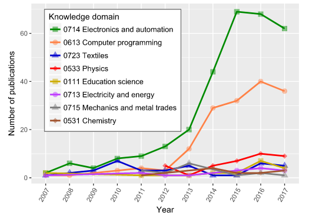
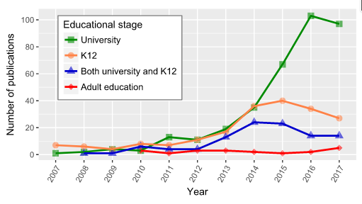

# Open-Source Hardware in Education: A Systematic Mapping Study

Heradio y colaboradores (2018) realizan una revisión de la literatura sobre hardware abierto en el ámbito educativo.
Las motivaciones para utilizar hardware abierto en educación que identifican como recurrentes son:

- Mejorar los métodos de enseñanza: aproximación práctica a la comprensión de conceptos abstractos de ciencia e ingeniería
- Reducción de costos: más económicos que alternativas propietarias, reutilizables, permiten mayor iteración, particularmente en el contextos de recursos escasos
- Involucrar a los estudiantes: fomentar su acercamiento e interés a partir del uso de tecnología
- Fomentar la creatividad de los estudiantes: llevar al estudiante a un rol activo donde pueda explorar su creatividad
- Aprendizaje a distancia: desarrollo de laboratorios remotos y experimentos a distancia con los estudiantes
- Generar datos sobre procesos de aprendizaje: hardware abierto para generar datos sobre cómo los estudiantes aprenden, dónde lo hacen, cuánto tiempo dedican

Además encuentran que es mayoritariamente utilizado en el ámbito universitario, seguido por la escolarización primaria; principalmente en los rubros de electrónica y computación.
Los autores identifican un cambio en la literatura orientada en un inicio a promover la creatividad y el interés de los estudiantes hasta 12 años en nuevas tecnologías, especialmente la inclusión de mujeres en STEM.
Después de este período inicial más de la mitad de las publicaciones, a partir de 2010, estudian el hardware abierto como forma de mejorar la educación universitaria y reducir costos experimentales.

 

A nivel global la literatura de hardware abierto en educación proviene principalmente de Estados Unidos (38%) seguido por España, Brasil, Alemania y el Reino Unido. 
Los autores coinciden en que la literatura a nivel global está en aumento, al igual que los rubros de aplicación
