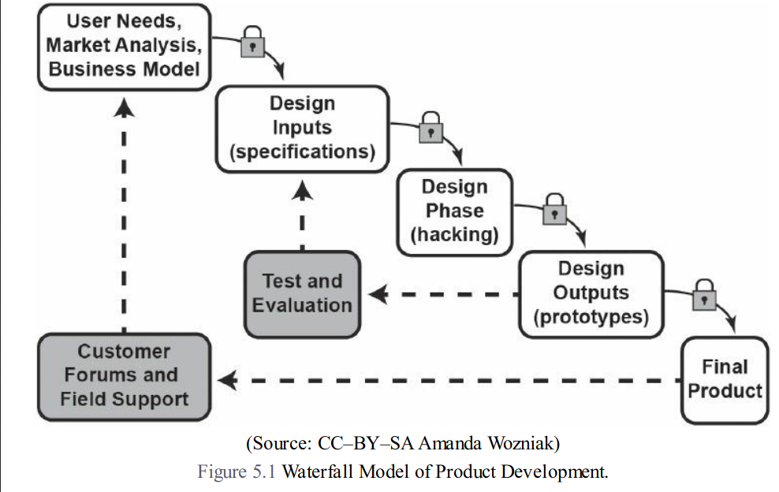
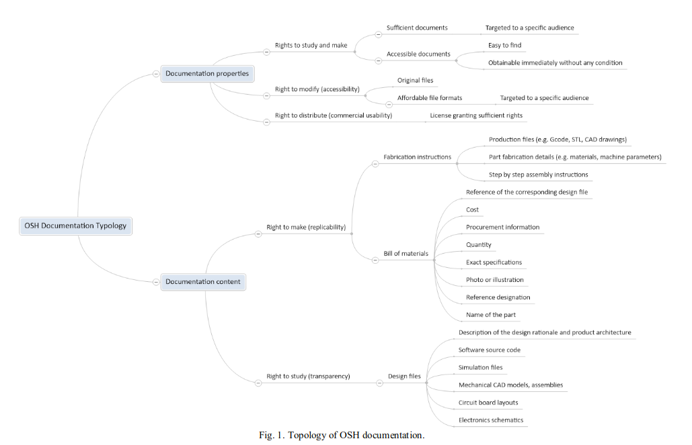
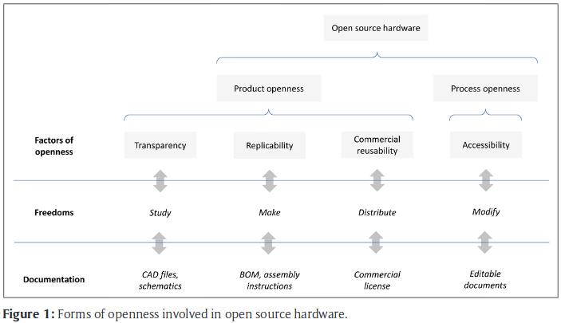
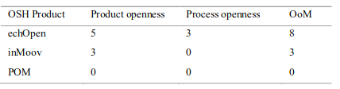
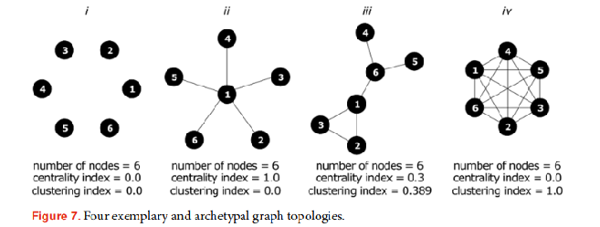
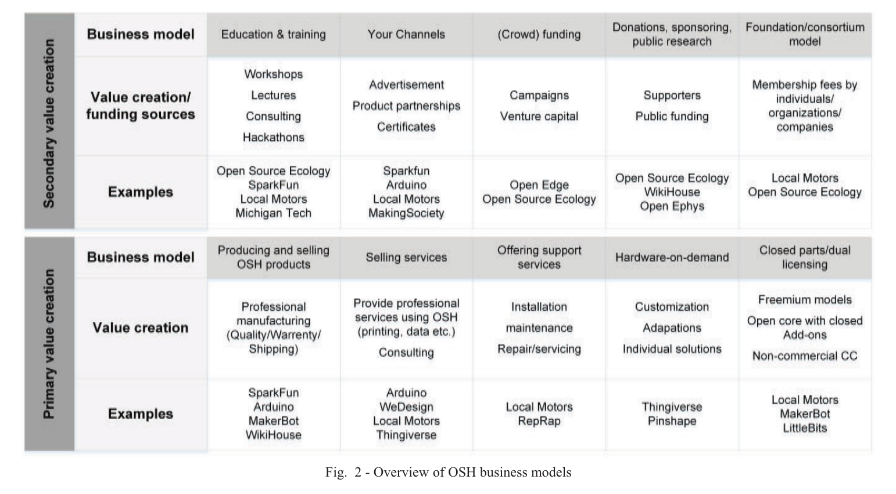
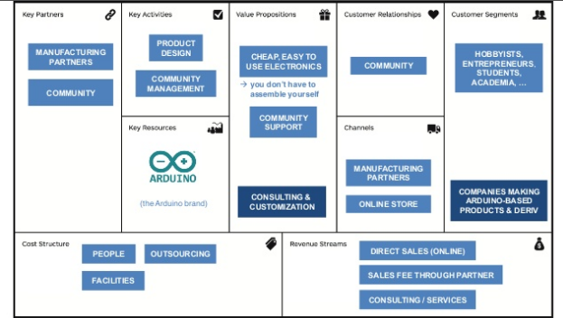

# Capítulo 1 - Introducción

## ¿Qué es el hardware científico abierto?

Cuando se quiere definir el término 'hardware' en español aparecen varios inconvenientes. 
El primero es la falta de una traducción. ¿Cómo se traduce 'hardware'? ¿Se trata de materiales, herramientas, tecnologías, dispositivos? 
¿Incluye materiales biológicos, reactivos, herramientas analógicas, mecánicas?
¿Es necesario traducirlo? 

En segundo lugar aparece la asociación directa del término al ámbito de la informática. 
Coloquialmente en español entendemos el concepto 'hardware' como el soporte físico o los componentes materiales de una computadora, equiparándolo al concepto de *'computer hardware'* en inglés. 
Esto genera algunos problemas dado que se pierden en la traducción acepciones importantes. 

*'Hardware'* originalmente incluye al conjunto de equipamiento o componentes utilizados para un fin en particular. 
Se trata de una definición amplia, que abarca tanto herramientas para crear música como equipamiento militar o ferretería industrial, por nombrar algunos usos.

Este trabajo de tesis trata sobre el caso particular del hardware científico abierto. 
Tomamos la definición de 'hardware científico' de la comunidad Global por el Hardware Científico Abierto ó GOSH (2018):

> *El Hardware Científico Abierto (HwCA) refiere a cualquier tipo de hardware utilizado en investigaciones científicas que pueda ser obtenido, ensamblado, utilizado, estudiado, modificado, compartido y vendido por cualquier persona.
> Incluye equipamiento tradicional de laboratorio tanto como materiales auxiliares como pueden ser sensores, reactivos biológicos, componentes electrónicos analógicos o digitales.*


El término 'abierto' que utilizamos también se toma de la convención de esta comunidad (GOSH, 2018):

> *La definición de Hardware científico abierto está en parte inspirada por las comunidades de Hardware Abierto y de Obras culturales Libres, pero los términos 'libre' (free) y 'abierto' (open) pueden prestarse a confusión.
> La palabra 'libre' (free) en inglés en el contexto de la tecnología se suele malinterpretar como 'gratis' (free of charge).*
>
> *Nosotros la entendemos, sin embargo, como la libertad de restricciones a comprar, hacer, utilizar, estudiar, modificar, compartir y vender.*
> *Estas libertades no implican que una tecnología deba ser gratis o no comercial.*
>
> *Utilizamos el término 'abierto' para el hardware científico en contraste al hardware cerrado propietario, pero se deben tener en cuenta los valores mencionados anteriormente.*

Esta distinción entre *'abierto'* y *'libre'* deriva de la barrera idiomática y se puede observar en la mayoría de las comunidades que trabajan con materiales no propietarios. En español esa ambigüedad no existe, por lo cual es común encontrar los términos *'hardware libre'*, *'tecnologías libres'*, *'tecnologías abiertas'* y otros en proyectos de Latinoamérica. 
Conociendo esta multiplicidad de denominaciones en la región, en este trabajo se utilizará la denominación *'hardware científico abierto'* ya que figura oficialmente en la traducción al español del manifiesto GOSH.

La definición de GOSH hace referencia a dos comunidades: de Hardware Abierto (OSHWA) y de Obras Culturales Libres, que son ligeramente diferentes. 

a) La comunidad [Open Hardware Association (OSHWA)](https://www.oshwa.org/) toma la siguiente definición de apertura:

>"Hardware abierto es aquel hardware cuyo diseño se hace disponible públicamente para que cualquier persona lo pueda estudiar, modificar, distribuir, materializar y vender, tanto el original como otros objetos basados en ese diseño.
>
>Las fuentes del hardware (entendidas como los ficheros fuente) habrán de estar disponibles en un formato apropiado para poder realizar modificaciones sobre ellas. Idealmente, el hardware de fuentes abiertas utiliza componentes y materiales de alta disponibilidad, procesos estandarizados, infraestructuras abiertas, contenidos sin restricciones, y herramientas de fuentes abiertas de cara a maximizar la habilidad de los individuos para materializar y usar el hardware. El hardware de fuentes abiertas da libertad de controlar la tecnología y al mismo tiempo compartir conocimientos y estimular la comercialización por medio del intercambio abierto de diseños".

b) Desde las [Obras Culturales Libres](https://freedomdefined.org) la apertura se basa en las cuatro libertades derivadas del software libre:

>
- la libertad de usar el trabajo y disfrutar de los beneficios de su uso
- la libertad de estudiar el trabajo y aplicar el conocimiento adquirido de él
- la libertad de hacer y redistribuir copias, totales o parciales, de la información o expresión
- la libertad de hacer cambios y mejoras, y distribuir los trabajos derivados
>

Adicionalmente la obra debe estar cubierta por una licencia cultural libre, o su situación legal debe proporcionar las mismas libertades esenciales enumeradas anteriormente. Esto sin embargo no es condición suficiente, ya que una obra específica puede ser no-libre de otras maneras que restrinjan las libertades esenciales.

Otros criterios adicionales para que una obra sea considerada libre dentro de esta comunidad son:

>
- Disponibilidad de los datos fuente: Si un trabajo final ha sido obtenido mediante la compilación o procesamiento de uno o varios archivos fuente, todos los datos fuente subyacentes deben estar disponibles junto con el propio trabajo bajo las mismas condiciones.
- Uso de un formato libre: Para los archivos digitales, el formato en que se haga disponible el trabajo no debe estar protegido por patentes, salvo que se conceda un permiso libre de regalías, ilimitado, irrevocable y de ámbito mundial para hacer uso de la tecnología patentada.
- Sin restricciones técnicas: La obra debe estar disponible de una forma en la que no se usen medidas técnicas para limitar las libertadas enumeradas anteriormente.
- Sin otras restricciones o limitaciones: La propia obra no debe estar cubierta por restricciones legales (patentes, contratos, etc.) o limitaciones (como derechos de privacidad) que impidan las libertades enumeradas anteriormente.
>

Las definiciones de las dos comunidades no son sustancialmente distintas, pero la primera ilustra el mecanismo utilizado para resolver el problema del traspaso desde código a objetos abiertos, una de las dificultades más importantes identificadas en la literatura (González y Gómez-Arribas, 2003; Rubow, 2008; McManara, 2007; FLOK, 2015). 
Para que el hardware sea abierto, se considera que lo que debe abrirse son los archivos correspondientes a su diseño (esquemáticos, listas de materiales, instrucciones de uso y armado, software, etc). 

Esta dificultad plantea preguntas interesantes alrededor de los conceptos de apertura y accesibilidad.
¿Es abierto un desarrollo que tiene entre sus componentes un microprocesador que sólo puede ser fabricado en un lugar del mundo? ¿O un desarrollo que requiere de un expertise que no está disponible en ciertas comunidades? 

Este capítulo tiene la intención de introducir el concepto de hardware científico abierto a través de un hilo imaginario que conecta las distintas etapas de desarrollo de un proyecto de estas características.
Comienza con los orígenes y antecedentes, siguiendo con los factores macro que favorecieron el crecimiento exponencial de estas prácticas en los últimos años, para luego pensar qué razones movilizan a las personas a diseñar estos proyectos, cómo lo hacen, qué beneficios y qué obstáculos se presentan en el camino e incipientes recomendaciones de políticas de promoción. 
A su vez se introducen algunos casos relevantes a nivel global, ya sea por la importancia de sus comunidades o su rol de habilitador o multiplicador de nuevas iniciativas.

## ¿Quiénes y por qué desarrollan hardware científico abierto?

En la práctica de hardware abierto confluyen corrientes heterogéneas, con orígenes en la figura del inventor hobbista y la tradición del hágalo-usted-mismo (o DIY), en las comunidades con una orientación política claramente definida, con influencias autonomistas y medioactivistas, en la ética hacker, y más cercano en el tiempo, en el emprendedurismo.
Esta sección intenta reconstruir los contextos y motivaciones que consideramos más relevantes al análisis de la comunidad de hardware científico abierto.

### Filosofía del Software Libre

La contribución del movimiento de Software Libre es clave para las diversas ramas de la producción abierta y colaborativa que surgieron potenciadas por el uso de plataformas online (Benkler, 2006).
Aunque el dominio específico de este movimiento sea el ámbito de la computación, su contribución fundamental radica en su filosofía y el uso de copyleft. 
Su principal referente es Richard Stallman, quien en 1985 creó la Fundación por el Software Libre (FSF por sus siglas en inglés). 
Después de graduarse en Harvard en 1971 Stallman comenzó a trabajar en el laboratorio de Inteligencia Artificial del MIT como programador, en un ambiente signado por la cultura hacker y la colaboración entre pares:

> *Whenever people from another university or a company wanted to port and use a program, we gladly let them. If you saw someone using an unfamiliar and interesting program, you could always ask to see the source code, so that you could read it, change it, or cannibalize parts of it to make a new program (Stallman, 1999)*

Este panorama de libre intercambio de código mutó hacia el inicio de la década de los '80, tanto por el éxodo de gran parte de la comunidad hacker hacia empresas privadas como por las restricciones que los fabricantes comenzaron a imponer sobre la copia y redistribución de código, alegando razones de competencia y amparados por la recientemente publicada Ley de Copyright de Estados Unidos, en 1976 (ref). 
Este carácter privativo de la producción de código continuaría en auge hasta el día de hoy, aunque con matices en los últimos años.

A partir de este cambio en 1983 Stallman inicia el proyecto GNU (GNU's Not UNIX) con el fin de producir un sistema operativo completamente libre. 
UNIX en ese entonces era uno de los sistemas operativos más ampliamente utilizados, privativo, creado por Ken Thompson y Dennis Ritchie tras abandonar un proyecto con MIT y sumarse a AT&T Bell Laboratories. 
Contar con un sistema operativo libre constituía la base que habilitaría cualquier desarrollo de código posterior.

Con el propósito de garantizar que la distribución de GNU no se volviera propietaria, Stallman crea el método *copyleft*: utiliza la ley de copyright para garantizar que el producto siga siendo libre, de forma contraria a su propósito original. 
El instrumento específico que utiliza es la *Licencia Pública General de GNU* (o GNU GPL por sus siglas en inglés), una licencia que garantiza al usuario libertades de uso, modificación, distribución y estudio al mismo tiempo que le impide agregar futuras restricciones a estas mismas libertades.

A principios de los años '90 existía suficiente desarrollo en la comunidad GNU como para crear un sistema operativo funcional, sin embargo el núcleo o kernel no estaba lo suficientemente desarrollado y por lo tanto el código no podía ser utilizado. 
Este componente es el que comenzó a desarrollar en 1991 Linus Torvalds, y que publicaría luego como Linux kernel bajo la licencia GPLv2, habilitando el uso de GNU-Linux a escala global.

Uno de los más importantes derivados del desarrollo del proyecto GNU y el trabajo de la Fundación por el Software Libre es el concepto de *código abierto* (open source), que surge como respuesta de un grupo de programadores dentro del mismo movimiento al término *software libre*.
El contenido político y la ambiguedad en inglés del término *free software*, que se a gratuidad, volvían difícil su adopción en el ámbito de los negocios. 
Es por esto que deciden generar un nuevo concepto, orientado a resaltar los beneficios en términos de colaboración y eficiencia, más cercano a la terminología empresarial.

En 1998 Eric Raymond -programador, autor de *La Catedral y el Bazar*, texto de referencia en el ámbito open source-, hace un llamado público a la comunidad de software libre a adoptar el nuevo término y funda la asociación *Open Source Initiative*. 
Contó con el apoyo de muchos personajes importantes de la comunidad en el primer *Open Source Summit*; entre otros Linus Torvalds. 
Richard Stallman se opone al concepto de código abierto ya que '*resalta la posibilidad de crear software potente y de alta calidad, pero evita las ideas de libertad, comunidad y principios*'.

A modo de ejemplo de las controversias en la comunidad, en 2007 luego de años de discusiones en la comunidad de software libre se lanzó la licencia GPLv3.
La mayor diferencia entre las versiones v2 y v3 es que la última prohíbe la *tivoización*, concepto acuñado por Stallman para referirse a dispositivos que utilizan software con licencia GPLv2 pero limitan las libertades del usuario mediante modificaciones de hardware. 
Torvalds se alejó de la discusión y no adoptó la GPLv3, por lo cual Linux sigue siendo GPLv2.

La visión del grupo disidente creció tanto en número como influencia convirtiéndose en hegemónica en la actualidad, con licencias específicas open source (ref) y un cada vez mayor número de compañías utilizando software de código abierto (ref), entre las cuales se encuentran grandes nombres como Google, Facebook o Microsoft. 
En los últimos años la definición de Código Abierto (ref) se modificó para incluir requerimientos adicionales a la libre disponibilidad del código, incorporando cláusulas de no discriminación a las personas, colectivos o grupos de trabajo.

Compartir de forma pública las innovaciones o mejoras realizadas de forma individual no constituye una novedad a través de la historia, ya que pueden rastrearse antecedentes en áreas tan diversas como la industria del hierro en el siglo XVIII (Allen, 1983) o el equipamiento médico (Von Hippel and Finkelstein,1979). 
Sin embargo el aporte del movimiento por el Software Libre a través del concepto de copyleft, sus licencias y la promoción del modelo de producción de pares sistematizó una forma de trabajar -e innovar- colaborativa, de libre circulación de la información. 

Según Mansell y Berdou (2008), GPL establece un proceso de gobernanza auto-propagador por fuera del control de autoridades nacionales, internacionales u organismos de regulación que usualmente controlan el diseño, producción y circulación del conocimiento y la información.
Este modelo descentralizado de producción sumado al éxito del modelo de software de código abierto inspiraron una expansión a diversas áreas (open source drugs, open design, free culture, entre otros), incluyendo el desarrollo de hardware abierto.

### Cultura hacker
Como se mencionaba anteriormente, la filosofía del software libre es uno de los pilares del movimiento de hardware abierto y en particular de hardware abierto científico. 
En los años de surgimiento alrededor de 1980 el MIT fue uno de los lugares donde la cultura hacker comenzó y floreció; la visión de este grupo se ve expresada en uno de los textos claves de la época: *'Hackers: Heroes of the Computer Revolution'* (Levy, 1984).

El libro de Levy hace explícita una *ética hacker* que incluye compromiso con la libre circulación de la información, la meritocracia y la creencia de que puede construirse un mundo mejor y más bello utilizando computadoras.
El concepto de libertad, ya sea en términos de libertad de expresión, privacidad, meritocracia o poder de los individuos, es constituyente principal del discurso hacker (Coleman, 2004; Kelty, 2005, 2008). 
Sin embargo la articulación de estos conceptos liberales toma diferentes formas en la interacción con sistemas socio-técnicos diversos, creando un set de expresiones relacionadas pero diferentes en torno a la propiedad, el trabajo y la creatividad (Coleman y Golub, 2008).

Maxigas (2012) propone reconstruir estas identidades diversas a partir de una genealogía de dos de los espacios predominantemente habitados por la comunidad hacker a partir de los años '90: los hackerspaces y los hacklabs. 
Esta aproximación resulta útil porque identifica dos formas que darán origen a los múltiples contextos ensamblados que encontramos en la actualidad.
Permite también entender cómo sobre la figura de los hackerspaces, por ejemplo, se suman en los últimos años nuevas comunidades como la de Biohacking.

#### Hacklabs, autonomistas y mediactivistas 
El primero de los casos se centra alrededor del espacio de los *hacklabs*. Yuill (2008) los define como '*[...] espacios voluntarios que proveen acceso público y gratuito a computadoras y a Internet [...] La mayoría de los hacklabs tienen talleres funcionando en una variedad de temas que van desde el uso básico de la computadora e instalación de software GNU/Linux, hasta programación, electrónica y radiodifusión independiente (o pirata).'* 

Los primeros hacklabs se desarrollaron en Europa alrededor de centros comunitarios en los *squats* y *medialabs* comunitarios. 
En Italia se les relaciona con los centros sociales autonomistas y en España, Alemania y en los Países Bajos con movimientos de ocupación anarquistas.

Los movimientos autonomistas, basados en conceptos marxistas y anarquistas, tuvieron relevancia en los años '70 en Italia, Alemania y Francia con la premisa de proveer alternativas a las instituciones administradas por el Estado. 
Una de sus estrategias era el *squatting* u ocupación de inmuebles.
Una de las actividades principales en los *squats* era la asignada a los centros comunitarios, donde se reproducían funciones alternativas a las desempeñadas por las instituciones del Estado.

El medioactivismo es la práctica de publicación periodística independiente con orígenes en la radiodifusión pirata y comunitaria de los años '60, muy activa en los años '90 y de rol clave en el surgimiento del movimiento alternativo a la globalización a través de la red Indymedia de comunicación independiente. 
Su objetivo entre otros era bajar las barreras a la participación de las personas en la producción cultural y tecnológica, y establecer una infraestructura de comunicación distribuida para organizaciones anticapitalistas. 
Con este fin las comunidades medioactivistas apropiaban y reutilizaban tecnologías de consumo masivo como grabadoras y otros productos electrónicos accesibles en los años '80, y más adelante computadoras personales.

Estas dos tendencias, autonomismo y mediactivismo, se combinan en el origen de los hacklabs. Los centros sociales ocupados requerían de infraestructuras de comunicación, acceso público a internet y computadoras; los mediactivistas desarrollaban estrategias para convocar, producir, enseñar y aprender sobre sus prácticas.

Algunos ejemplos de hacklabs son Ultralab en Forte Prenestino, Italia, surgido a fines de los '90, que se autodefine como un *'patrón emergente de la conjunción de necesidades tecnológicas de las comunidades'* que lo integran. 
Otro ejemplo más reciente es Hackney Crack House en Londres, que hasta 2012 proveía una red de área local y servidor al espacio ocupado donde se alojaba, y funcionaba como lugar de reunión para experimentar con distintas tecnologías.

Dado su origen los hacklabs son espacios declaradamente políticos enfocados en desarrollar infraestructura de comunicaciones para las comunidades que los habitan, privilegiando la creatividad y el acceso a quienes generalmente se ven inhabilitados para ello.

#### Hackerspaces y expansión
El caso de los hacklabs descrito anteriormente es un extremo del espectro político, en el otro podemos ubicar a los hackerspaces. El gradiente incluye fablabs, makerlabs, innovation labs y espacios de co-working; con diferentes grados de inmersión institucional ya sea en empresas o universidades.

La primer ola de hackerspaces se relaciona a la cultura hacker universitaria ya mencionada del MIT y otros institutos en los Estados Unidos, donde se desarrollaban las primeras computadoras y sistemas operativos.
Esta escena se completaba con grupos que hacían ingeniería reversa de las nuevas tecnologías (phreakers), en ese momento mayoritariamente redes telefónicas.
En Europa la historia está menos documentada pero uno de los hitos es la fundación del Chaos Computer Club en 1981, espacio comunitario hacker con fuerte foco en la investigación sobre seguridad informática y privacidad.

Una nueva ola de hackerspaces parece haber sido iniciada a partir de una serie de conferencias en 2007 y 2008, orientadas a los problemas prácticos de cómo se administra y organiza un espacio de estas características.
Resulta relevante ya que pone el concepto de hackerspace nuevamente en discusión, y se hace un llamado a crear nuevos espacios.

El modelo es de membresía abierto, donde los miembros pagan por la utilización del inmueble y las herramientas, y se desarrollan actividades de aprendizaje, producción de pares y socialización.
Aunque las actividades varían entre distintas iniciativas, Maxigas (2012) identifica un gradiente temporal que inicia con desarrollo de proyectos de software libre, desarrollo de infraestructura de redes, luego microelectrónica y en algunos casos adquisición de herramientas de fabricación digital, como impresoras 3D.
El surgimiento de Arduino provocó una explosión de proyectos e interacción en este tipo de espacios, muchos de ellos con fines educativos, facilitando el diálogo con las instituciones formales como universidades o escuelas. 

El desarrollo y expansión de los hackerspaces se alinea con la trayectoria del movimiento hacker, desde movimiento contracultural y de nicho a comunidades que ganan cada vez mayor anclaje institucional.
El trabajo con hardware y herramientas de fabricación digital provocó una expansión de este modelo, ya que la colaboración en este tipo de proyectos se ve facilitada por la disponibilidad de espacios comunes. 
El contenido político en los hackerspaces está menos implícito, con un discurso más flexible, orientado a valores liberales, que le permite una flexibilidad o y expansión hacia un espectro mayor de actores: desde el público general a las empresas.

### Cultura Do-it-yourself (DIY)
Las actividades en los hackerspaces confluyen en numerosas oportunidades con la cultura del **Hágalo Usted Mismo** (“Do it yourself” o DIY, también autodenominados 'makers'), mencionada anteriormente aldededor del desarrollo de Arduino, RaspberryPi y otros microcontroladores accesibles al gran público.
Algunos antecedentes culturales de estas actividades incluyen las actividades de radio aficionados (Douglas, 1987) y las prácticas DIY de mitad de siglo XX en Estados Unidos (la figura del inventor o hobbista), donde actividades previamente conceptualizadas como utilitarias se transformaron en recreativas (Haring, 2006).

Para entender la práctica DIY en la actualidad resulta útil la distinción que Hertz (2011) realiza sobre DIY utilitario y DIY hedonista.
El primero responde a la necesidad de construir objetos con los materiales disponibles, muchas veces escasos o inapropiados, para resolver problemas de la vida cotidiana; el segundo refiere a la fabricación motivada por el elemento lúdico, la exploración personal y el aprendizaje por sí mismos.
Más allá de ser útil al análisis y la comprensión de las motivaciones, en la realidad ambos conceptos suelen superponerse, con elementos predominantes de una u otra categoría.

En la mayoría de los espacios más visibles de la comunidad maker (revista MAKE, eventos como MakerFaire, plataformas online como HackaDay o Instructables) predomina el elemento hedonista, orientado a la personalización de objetos de consumo o experimentación con distintos materiales.
Según Mark Frauenfelder -editor jefe de la revista MAKE- las motivaciones de la comunidad maker responden a una insatisfacción con la cultura del consumo y del descarte, y a una revalorización del concepto japonés de *wabi-sabi* o la "*apreciación de la imperfección de los objetos*" (Suzuki, D.1959). 

Uno de los conceptos clave es el de *caja negra*: la velocidad de las innovaciones en materia de tecnología implica que los objetos de consumo estén producidos de forma tal que no es posible para el usuario comprender su lógica interna sino sólo el resultado de su funcionamiento.
Este rol pasivo de los consumidores, que no pueden reparar ni personalizar sus objetos, genera una reacción por parte de la comunidad DIY, que construye objetos de consumo con componentes simples y compartiendo información, algo que Frauenfelder engloba en el concepto de *'vivir auténticamente'*.

Algunos autores caracterizan a la cultura DIY actual como consumista y exclusiva (Williams, 2004); otros como Hertz o Ratto van más allá y proponen el concepto de *'critical making'*; un quehacer crítico que combina el desarrollo tecnológico con un compromiso social, personal y ciudadano' (Hertz, 2011).

Cuando la distinción entre DIY hedonista y utilitario se quiere aplicar al hardware abierto científico surgen algunos problemas, ya que la percepción es que las motivaciones son híbridas. 
Según el análisis de Kera (2018) sobre iniciativas de hardware científico abierto, lo que caracteriza estas iniciativas es que integran la ciencia a la vida cotidiana y por lo tanto a esferas políticas, artísticas y lo que denomina *'ciencia artesanal'* (usos exploratorios).


Los *artesanos científicos* combinan la búsqueda del conocimiento y la construcción de instrumentos con las necesidades de sus comunidades (utilitario) pero también con las propias (espíritu lúdico).
Este aspecto híbrido los vuelve puentes útiles entre dominios del conocimiento generalmente desconectados (ingeniería, humanidades, arte, ciencia) pero también hacia dominios cívicos como el activismo, la colaboración y los valores comunitarios.

### Biohacking o DIY biology
Garage biology, biohacking o biología ciudadana/comunitaria son expresiones que describen un movimiento de amateurs realizando experimentos biológicos fuera de los ámbitos tradicionales como universidades o corporaciones.
Delfanti () analiza *DIYbio*, la iniciativa más reconocida del ambiente, una red creada en 2008 compuesta de varios grupos en ciudades de Europa y Estados Unidos.
DIYbio tiene como objetivo proveer a los no expertos con un espacio de colaboración, protocolos y herramientas de código abierto para la investigación biológica.
Como tales, son parte del fenómeno de la producción abierta y colaborativa a través de plataformas online (Benkler, 2006).

Los miembros de la comunidad tienen relación con el movimiento hacker: desarrollan sus espacios bajo el modelo de hackerspaces o directamente instalan una sección 'bio' en hackerspaces existentes.
Están además inmersos en una red de emprendedores y start-ups que enfrentan al gran mercado de las compañías del rubro de la biotecnología.
En 2008 el movimiento comenzó con Mackenzie Cowell, un desarrollador web, y Jason Bobe, parte del proyecto Genoma en la escuela de Medicina de Harvard.
En 2010, cerca de 2000 personas eran parte de la lista de correos y existían docenas de grupos comunitarios desde Boston a Bangalore.

Las actividades incluyen proyectos de ciencia ciudadana simples como aislamiento de bacterias o extracción de ADN, pero también construcción de hardware científico abierto (Ward, 2010).
DIYbio dialoga con instituciones como universidades, compañías, medios y agencias gubernamentales preocupadas por cuestiones de ética y seguridad (Schmidt, 2008).
Sus miembros son jóvenes biólogos, profesionales de la computación que desean experimentar en biología y artistas interesados en un abordaje crítico DIY a la biología.

En cuanto a cómo se definen, la comunidad nombra referencias como la cultura hacker, el DIY y el movimiento del Software libre, el espíritu lúdico y 'biopunk'.
Establecen comparaciones con el *Homebrew Computer Club*, el centro de operaciones hacker de los '70 en la Bahía de San Francisco donde se encontraban Steve Wozniak, Bill Gates, Steve
Jobs y otros (Bloom, 2009; Economist, 2009; Golob, 2007; Johnson, 2008). 
Otros se definen como makers, artesanos, entusiastas, hobbistas o amateurs pero coinciden en la visión de la innovación norteamericana y la cultura de garage.

Como colectivo resaltan la importancia del rol educativo sobre las biotecnologías, especialmente frente a dudas sobre seguridad o ética en las prácticas (DIYbio 2010). 
La apertura es un requisito de la iniciativa a fin de volver el campo *'accesible para quien desee involucrarse'*.
El acceso a equipamiento científico es uno de los obstáculos principales en estos proyectos, siendo uno de los ámbitos más productivos del hardware científico abierto con ejemplos como OpenPCR (http://openpcr.org). 

### Latinoamérica: el movimiento de tecnología apropiada y las pedagogías críticas
El panorama del hardware científico abierto tanto en Latinoamérica como en otras regiones del denominado 'Sur Global' presenta algunas particularidades; en general el discurso se orienta hacia las potencialidades para el desarrollo, conectando con temáticas postcoloniales (Kera, 2018).
Esta visión está presente en GOSH desde el manifiesto bajo las ideas de empoderamiento, justicia cognitiva, brecha norte-sur, conocimientos indígenas, desarrollo endógeno.
Particularmente en Latinoamérica existen grupos que son parte de GOSH y trabajan en temáticas cercanas a la agroecología, la educación popular y la revalorización del conocimiento indígena.

Estas concepciones y áreas de trabajo se alinean con las ideas del movimiento de Tecnología Apropiada, predominante en los años '80 en la región. 
Las ideas de la Tecnología Apropiada (TA) se originaron en los debates sobre desarrollo y asistencialismo de los años '60, bajo el concepto de *tecnologías para el desarrollo*. 
La búsqueda se orientaba a principios de diseño de tecnologías situadas, ambiental y socialmente justas involucrando comunidades locales (Kaplinksy, 1990; Willoughby, 1990).
El término 'tecnología apropiada' implicaba un set de características comunes: tecnologías de bajo costo, fabricadas con materiales locales, generadoras de empleo, empleando mano de obra local, pequeña escala, sin requerir expertise o educación de tipo hegemónico 'occidental', de uso colaborativo o colectivo, sin uso de patentes o propiedad intelectual. 

Casi todos los países de Sudamérica tuvieron algún tipo de actividad de TA en los años '80 en forma de centros y programas de investigación autónomos.
Estos centros reunían ingenieros, economistas, sociólogos y trabajadores sociales, algunos estudiantes y voluntarios y escasos vínculos a instituciones académicas.
Las ideas globales de la TA no se ajustaban a la realidad latinoamericana de los '80, por lo que la primer tarea de los centros fue desarrollar nuevos marcos en torno a los actores, situaciones y problemas locales.

Lo que caracterizó al movimiento en Latinoamérica fue su esfuerzo por construir un abordaje distinto, participativo que utilizara el desarrollo de artefactos, técnicas y prácticas materiales como una herramienta para la autonomía y nuevas formas de activismo y conciencia política.
Sus impulsores experimentaban con metodologías que permitieran a las comunidades definir sus propios problemas y probar sus alternativas. 
Se trataba de una aproximación práctica, que surgía del trabajo a campo y por ende flexible a incorporar distintos enfoques; las metodologías incluían por ejemplo procesos de co-diseño de tecnologías, auto-organización y construcción desde los usuarios.

Las ideas de la TA en la región fueron inevitablemente influenciadas por los debates e ideas de la educación popular, investigación acción participativa, agroecología y revalorización del conocimiento indígena. 
Autores como Paulo Freire y Orlando Fals Borda tuvieron una gran influencia, contribuyendo a delinear nuevas aproximaciones a la participación (Kaimowitz, 1993). 

A medida que las políticas neoliberales comenzaron a predominar en la región, las agencias de desarrollo se vieron somentidas a "ajustes estructurales" (Rist, 2011). 
Algunas iniciativas de TA lograron sobrevivir a partir de fondos que buscaban reconstruir procesos de democratización luego de las dictaduras latinoamericanas, aunque con enfoques diferentes. 

Las ideas del movimiento de TA impulsaron nociones sobre la tecnología que pueden rastrearse en distintas iniciativas, como la Red de Tecnologías Sociales en Brazil a comienzos del siglo XXI.
Los procesos de participación pública e inclusión de conocimientos locales son una práctica común en los proyectos actuales de desarrollo (Chambers, 1997; Pieterse, 1998), con sus críticas (Cooke & Kothari, 2001; Hickey & Mohan, 2004).

El concepto de tecnología apropiada aparece explícitamente mencionado en trabajos sobre hardware científico abierto asociados al desarrollo sostenible (Pearce et al, 2010). 
Esta acepción del hardware científico abierto 'para el desarrollo' se puede observar en el trabajo de grupos que realizan monitoreos ambientales comunitarios o trabajo con comunidades campesinas, o en iniciativas como Trend4Africa, donde se capacita personal local en construcción de hardware científico abierto para equipar laboratorios de bajos recursos en varios países africanos.

## ¿Por qué ahora?
Como se menciona en las secciones anteriores, la filosofía del software libre surgió en los años '80, la cultura del do-it-yourself tiene raíces aún anteriores y los científicos modifican sus equipos y herramientas desde hace al menos 30 años (von Hippel, 1976).
Sin embargo en los últimos años se puede observar un crecimiento explosivo de los proyectos y las publicaciones sobre hardware abierto en ciencia, educación y hobbismo/productos de consumo.

Varios autores (von Hippel, ?; Huang, 2017; Pearce, ?) argumentan que la dominación histórica de la producción de hardware por parte de grandes compañías descansa en dos razones principales: la fabricación es costosa y requiere de expertise muy específico.
Huang (2017) identifica una ventana de oportunidad para el hardware abierto en los últimos años a partir de la desaceleración de la performance en innovación de las grandes compañías, sumada a un revival en los usuarios de la cultura de la reparación, en respuesta a la velocidad a la que la tecnología se vuelve obsoleta.

Uno de los factores más relevantes en este proceso es la difusión de la fabricación digital, con herramientas como impresoras 3D (ver Box XXX), clave para el desarrollo de proyectos de hardware abierto, pero también cortadoras láser, CNC y otros (Söderberg, 2013).
La literatura coincide en que la aparición de plataformas de prototipado de bajo costo y accesibilidad en términos de expertise, como Arduino, tienen un rol fundamental en la tendencia a la descentralización de la producción (Pearce, 2017; Söderberg, 2013; Powell, 2012). 

Pearce aduce que se habrían reducido los costos de producir hardware científico en un 90–99% respecto de equipos propietarios de misma funcionalidad (Pearce, 2014a; Pearce,  2014b). 
Powell (2012) identifica cómo los costos de fabricación disminuyen a partir de que muchas etapas de la producción de hardware pueden hoy ser reemplazadas con software, y componentes simples pueden ser impresos en diversos materiales a bajo costo. 
Von Hippel, también en este sentido, menciona cómo la habilidad de innovar de los usuarios es mayor en los últimos años gracias a la disponibilidad de software y hardware de alta calidad y facilidad de uso sumado al acceso a información compartida.

Actualmente es posible diseñar un prototipo de forma virtual, probarlo y obtener una primera versión física sin demasiado esfuerzo, que posteriormente puede fabricarse a escala gracias a servicios de 'diseño para fabricación', como los que presta la compañía Seeed Studio en China.
En el mundo del hardware abierto para productos de consumo esto es una práctica difundida, que lentamente comienza a ser explorada en el ámbito del hardware abierto para ciencia.

La práctica colaborativa de compartir los diseños, facilitada por la masificación de internet como medio de comunicación de bajo costo, permite la formación de comunidades donde la información sobre fabricación circula libremente.
El proceso se ve facilitado por la existencia de numerosos y cada vez más frecuentes espacios físicos de innovación de distinto tipo, ya sean hacklabs, makerspaces, fablabs, centros comunitarios de innovación u otros (Maxigas, 2012; Kera, 2012).

## ¿Cómo se hace hardware abierto?

### Herramientas de fabricación digital 
Como se mencionaba en la sección anterior, el desarrollo y difusión de herramientas de fabricación digital tiene un impacto directo en el surgimiento de proyectos de hardware abierto (Söderberg, 2013).
Muchas de las herramientas tecnológicas que conforman la práctica de la fabricación digital no son particularmente nuevas; lo novedoso son las reducciones de los costos y escala de las tecnologías y un aumento de la versatilidad en el proceso de fabricación (Fressoli y Smith, 2015).

En términos de acceso, los usuarios pueden disponer indivualmente de las herramientas o acudir a espacios comunitarios donde abonan una tarifa por tiempo de uso (o usan sin costo) las que se encuentren disponibles (de Brujin, 2010; Mellis, 2014).
Los espacios comunitarios permiten acceder a herramientas más complejas y costosas que las accesibles al usuario individual, y ofrecen oportunidades para el aprendizaje y el intercambio.
También existe la posibilidad de contratar una variedad de servicios de fabricación digital a distancia, lo que incrementa tanto la velocidad como el costo del proceso pero disminuye el control del usuario sobre el mismo y la posibilidad de iteración.

En esta sección se detallan las herramientas de fabricación digital más utilizadas en los proyectos de hardware abierto, aunque existe una variedad de otras herramientas específicas desarrolladas por los usuarios. 

#### Impresión 3D
Uno de los disparadores del crecimiento de la impresión 3D fue la expiración de las patentes de los equipos creados en la década de 1980.
A modo de ejemplo, en 2009 expiró la patente del proceso de modelado por deposición fundida (conocido como FMD por su sigla en inglés) que utiliza filamentos plásticos, ocasionando una explosión de experimentación en el rubro (Fressoli y Smith, 2015).

El proyecto RepRap (nombre corto de 'Replicating rapid prototyper'), iniciado por Adrian Bowyer en la Universidad de Bath (Reino Unido), es uno de los casos paradigmáticos dentro de la impresión 3D.
Su objetivo original era desarrollar una herramienta de fabricación de bajo costo capaz de producir una copia de sí misma, basada en archivos digitales de diseño (de Brujin, 2010).
Utilizando procesos aditivos de fabricación, la RepRap se comercializa a menos de 500 euros, garantizando el acceso a una gran cantidad de usuarios.

Diferentes modelos de impresoras 3D pueden utilizarse con diversos materiales, resoluciones y tolerancias; ampliando el espectro de estabilidad, propiedades ópticas, apariencia, acabado y demás propiedades (Mellis, 2014).
En proyectos de hardware abierto se suele utilizar la impresión 3D para confeccionar mecanismos para movimiento, encastres, cajas o contenedores de plaquetas. 
Las especificaciones de diseño, geometría, materiales y resistencias se distribuyen fácilmente en archivos digitales editables con FOSS especializado (Blender, OpenSCAD), lo que facilita la colaboración dentro de las comunidades.

#### Cortadoras láser, tornos CNC y otros
Las cortadoras láser y los tornos CNC (control numérico) son otro ejemplo de herramientas ampliamente difundidas en fablabs o makerspaces. 
Las primeras permiten calar, cortar o grabar materiales como maderas balsas, cartón, acrílico y otros; existen variedades que cortan vinílico y otras basadas en chorro de agua para cortar materiales más densos.
En el caso de los tornos CNC, su utilización permite la remoción controlada de materiales con alta precisión a partir de bloques sólidos.

Estas herramientas trabajan con una variedad mayor de materiales respecto de la impresión 3D, pero son más limitadas en términos de las geometrías que pueden producir, e involucran un proceso más largo de fabricación, ensamblado y acabado. 
Nuevamente las especificaciones geométricas, de material y ensamblado son fácilmente distribuidas en archivos digitales, aunque requieren de ajustes particulares adaptados a cada máquina. 

Para materiales textiles existen también herramientas de control numérico que emulan el proceso de bordado o del telar.
Otros dispositivos como brazos robóticos y partes adaptables son cada vez más comúnmente desarrolladas por los usuarios (Mellis, 2014).

#### Circuitos impresos y electrónica
Mellis (2014) considera la producción de circuitos impresos como un proceso de fabricación digital.
Una vez probado el prototipo, a partir de los diseños digitales se pueden producir placas impresas con componentes soldados.
El proceso puede realizarse con máquinas CNC en espacios comunitarios o mediante servicios que ofrecen la fabricación a usuarios individuales.

Uno de los principales obstáculos identificados a la hora de replicar diseños electrónicos es efectivamente conseguir los componentes necesarios (GOSH, 2018). 
La alta especificidad de algunos diseños hace que sea muy complejo encontrarlos, sumado a que en algunos países existen limitaciones de importación.
El ensamblado además requiere de cierta habilidad manual para la soldadura y experiencia en resolución de problemas. 

### Diseño y fabricación: de la idea al prototipo, del prototipo al producto

Mellis (2010) identifica cinco formas de interacción de las personas con el hardware abierto, a partir del estudio del proceso de adaptación de un diseño de radio FM:

- Hacer: replicar el objeto a partir del diseño digital, lo que permite a los usuarios entender cómo está hecho, ensamblado y cómo funciona.

- Personalizar: modificaciones simples que no afectan la funcionalidad del diseño pero crean una conexión personal entre el objeto y su desarrollador

- Diseñar: Utilizando el diseño original como patrón, diseñar una nueva forma manteniendo aspectos requeridos para el ensamblado o funcionamiento

- Desarrollar: explorar posibilidades técnicas y aprendizajes a través de situarlos en un contexto (el del objeto) que motiva e inspira nuevas ideas

- Experimentar: probar usos, lógicas, materiales o percepciones diferentes alrededor de un objeto

En todas las acepciones mencionadas salvo la primera, el usuario interviene el objeto para crear algo diferente.
En la literatura y en la práctica este proceso se denomina 'derivado', 'remix' o 'fork', y es identificado como clave en el desarrollo de la innovación (van den Bergh 2008; Kogut and Zander 1996; Schumpeter 1934). 
En el caso de FOSS son numerosos los trabajos que estudian la dinámica de la creación de derivados en una comunidad para inferir modelos de interacción (ver próxima sección). 
En hardware estos estudios son incipientes pero cada vez más numerosos (Kyriakou, 2014; Bonvoisin, 2018).

Los pasos necesarios para construir hardware electrónico han ido mutando a partir de la disponibilidad de herramientas de fabricación digital y FOSS que permite emular etapas de diseño y testeo.
Sin embargo aún se precisa contar con ciertos conocimientos y herramientas específicos en términos de electrónica o programación.

La mayoría de los proyectos comienzan con una idea prototipada rápidamente como prueba de concepto.
Para ello suelen utilizarse plaquetas que facilitan el prototipado como Arduino o RaspberryPi, sensores y componentes específicos, y protoboards, que son básicamente cajas de plástico con orificios conectados entre sí que permiten crear un circuito sin necesidad de soldar cables o componentes.
En este punto el diseño no es perfecto, sólo sirve para comprobar que funciona y determinar qué componentes son necesarios.


Una vez que el diseño está probado, el paso que sigue es volcarlo en una plaqueta de circuito impreso o PCB, donde los componentes se sueldan y el diseño gana estabilidad.
En la actualidad todos los objetos electrónicos se fabrican utilizando PCBs, a diferencia del sistema de cableado punto a punto utilizado hasta los años 60. 

En los circuitos impresos las conexiones están constituidas por líneas de cobre integradas en un soporte no conductor -generalmente epoxy- que además sostiene los componentes.
Estas innovaciones permitieron no sólo reducir el espacio que ocupa el circuito sino también integrar el uso de microchips, el corazón de las tecnologías como teléfonos móviles, computadoras, tablets y más.

<br>
    
*Fig 4: ejemplo de diseño digital de circuito impreso (izq.) y circuito final (der.) (Fuente: Wikipedia)*

El traspaso de prototipo a PCB requiere que el diseño se encuentre digitalizado en dos partes: un diagrama esquemático ('schematic') y un diagrama de diseño ('layout'). 

El diagrama esquemático es un gráfico donde se especifican los componentes electrónicos (resistencias, capacitores, circuitos integrados) a utilizar y sus conexiones, a través de un sistema de símbolos. 
En caso de ser necesario también se indican datos sobre valores específicos para cada componente (por ejemplo una resistencia de 10-kilohm). 
El diagrama de diseño especifica la disposición física del circuito en la placa que lo sostiene.
Tanto el esquemático como el layout se obtienen mediante FOSS especializado, como Fritzing o KiCad.


*Fig. 3: Ejemplo de diagrama esquemático para un cargador de batería DIY (Fuente: Circuit Digest)*


*Fig. 3: Ejemplo de PCB layout para un cargador de batería DIY (Fuente: Circuit Digest)*

Los dos productos de la etapa anterior son luego transformados en archivos vectoriales denominados 'Gerber' que pueden ser leídos por un fabricante, donde se detallan tamaño de componentes, forma y conexiones y se diseña la configuración física final del circuito. 
Es un proceso orientado gráficamente, en el cual el diseñador ubica los componentes y las conexiones de la forma más eficiente posible -el software propone el arreglo más conveniente aunque siempre requiere retoques por parte del diseñador-. 
Dado un set Gerber, el fabricante puede crear una o cien mil copias de un circuito.

```
G04 Short version a file taken from the Example Job 1, created by Filip Vermeire, Ucamco*
%TF.FileFunction,Copper,Bot,L4*%    
%TF.Part,Single*%    
%FSLAX35Y35*%    
%MOMM*%    
%TA.AperFunction,Conductor*%    
%ADD10C,0.15000*%    
%TA.AperFunction,ViaPad*%
%ADD11C,0.75000*%
%TA.AperFunction,ComponentPad*%
%ADD12C,1.60000*%
%ADD13C,1.70000*%
%SRX1Y1I0.00000J0.00000*%
G01*
G75*
%LPD*%
D10*
X7664999Y3689998D02*
X8394995D01*
X8439999Y3734999D01*
X9369999D01*
D11*
X7664999Y3689998D03*
X8359999Y1874998D03*
X9882998Y3650498D03*
D12*
X4602988Y7841488D03*
D13*
X10729976Y2062988D03*
X10983976D03*
X11237976D03*
M02*
```    
_Fig 5: ejemplo de archivo en formato Gerber, para ser leído por el fabricante (Fuente: Wikipedia)_

#### Buenas prácticas de diseño
Aunque la barrera de acceso a la fabricación de hardware es menor en la actualidad, autores como Wozniak (2014) y Oberloier (2017) consideran que las buenas prácticas de diseño son fundamentales para asegurar que la mayor cantidad posible de personas puede acceder y replicar los desarrollos.

Wozniak (2014) propone un modelo ideal de diseño de producto para hardware al que denomina 'cascada', que imita al proceso que se realiza a nivel industrial. 
En el mismo se detallan etapas de definición de especificaciones, diseño, prototipado y testeo; el proceso es necesariamente iterativo pero requiere de avances secuenciales. 



Oberloier detalla aún más este y otros requisitos en su procedimiento general para el diseño de hardware científico abierto (2017).
La guía incluye no sólo recomendaciones para el diseño si no para la documentación y colaboración, bajo cinco preceptos principales:

1. Hacer una revisión de la literatura previa para basarse en diseños pre-existentes, y si no existen antecedentes, realizar una prueba de concepto simple
    - Este paso asegura que no se 'reinventa la rueda' y se contribuye al pool de conocimientos existente. 
2. Diseñar teniendo en cuenta:
    - Utilización de FOSS para garantizar replicabilidad
    - Minimizar el tipo de partes y complejidad para asegurar reparabilidad, actualización y mantenimiento
    - Minimizar el volumen de material y costo de producción para disminuir el impacto ambiental, costos económicos y tiempo de desarrollo
    - Utilizar componentes ampliamente disponibles en el mercado cuando no se trate de piezas personalizadas, para facilitar replicabilidad
3. Validar el diseño a través de un proceso de calibración de bajo costo y transparente.
4. Documentar el diseño, fabricación, ensamblado, calibración y operación en detalle, orientado a un no especialista, siguiendo las guías de OSHWA.
5. Compartir la documentación en repositorios open source específicos (Open Science Framework, Github, 3DPrint Exchange, Open Circuit Institute)

Un principio compartido por todas las recomendaciones (Gibb, 2014) es la *modularidad*, que consiste en separar las distintas funciones de un desarrollo en partes intercambiables, que puedan ser modificadas y probadas por sí mismas.
En su análisis del proceso de construcción de un derivado open source, Mellis & Buechley (2011) destacan en particular la importancia de la modularidad ya que permite a usuarios menos experimentados utilizar los diseños como patrón y modificar las partes que les interesan, sin afectar la funcionalidad.

Yanamandra (2014) identifica la modularidad en software como la característica fundamental de FOSS que aún no es trasladada a hardware.
Esto hace que el abordaje del hardware abierto resulte demasiado complejo para la mayoría de las personas, debido a la diversidad de expertise necesaria para su desarrollo.

### Documentación y grados de apertura
Uno de los obstáculos principales identificados en la literatura es que compartir conocimiento sobre átomos no es tan sencillo como compartir conocimiento sobre bits: el diseño de objetos precisa de otras representaciones como esquemáticos 2D o 3D para ser reproducibles (Bonvoisin, 2017).
En general los componentes de hardware de los proyectos están documentados en menor grado que los de software (Raasch et al, 2009), originando gradientes de apertura y discusiones sobre qué sí es y qué no es hardware abierto.

Desde 2016 OSHWA ofrece un programa de auto-certificación que permite utilizar el logo de hardware abierto si se cumple con su definición, con 180 proyectos suscriptos a mayo 2018 (Bonvoisin y Mies 2018).
Sin embargo esta propuesta no establece los requisitos mínimos del contenido de la documentación, si no que está orientada a los aspectos del producto relacionados a las licencias abiertas, asumiendo que ésto garantiza la apertura.

Los proyectos de hardware abierto no están centralizados en un repositorio principal, como sí lo hacen las comunidades de software o impresión 3D (Raasch and Herstatt, 2011).
La comunidad tiende a utilizar una variedad de plataformas para colaboración y difusión (Bonvoisin et al. 2017) como ser GitHub, Thingiverse, Instructables (mayoritariamente personalización del consumo), Docubricks, Open Science Framework (científicos), Kit Space (electrónicos).
Adicionalmente los diseños pueden publicarse en revistas especializadas, como el Journal of Open Hardware ó HardwareX, pero también de rubros específicos, como revistas sobre diseño, ingeniería, instrumental científico o médico, educación.

El control de versiones es una de las prácticas más utilizadas para documentar la colaboración en el desarrollo de FOSS, mediante la cual todas las contribuciones de usuarios a un proyecto son históricamente registradas y se encuentran disponibles para reutilizar.
Una de las herramientas más populares para realizar control de versiones es *git*, el software que originalmente se desarrolló para gestionar las colaboraciones sobre el kernel Linux, y que en los últimos años se encuentra asociado a plataformas web como GitHub, GitLab y otras.

Yanamandra (2014) identifica el control de versiones como una práctica fundamental utilizada en software que debe ser trasladada a los archivos de diseño de hardware para permitir la colaboración real.
Considera que existe la necesidad de desarrollar una plataforma que cubra los requerimientos específicos que demanda la colaboración en hardware y permita el crecimiento y gestión de la comunidad.

En cuanto al contenido de la colaboración, Wagenknecht (2014) propone una primera taxonomía de la documentación necesaria para los proyectos de hardware abierto que incluye:

- Archivo README con una descripción rápida del proyecto, licencias, atribución, tiempo y costo de fabricación y nivel de expertise necesario

- Sitio web para dirigir al usuario a los recursos relevantes y a los canales de comunicación rápidamente

- Lista de materiales (ó BoM por sus siglas en inglés) considerando diferencias de disponibilidad de materiales entre países, principales proveedores, costos y hojas de producto
    
- Tutoriales en imagen o video 

- Archivos fuente de hardware que pueden incluir:
    - Dibujos 2D o archivos CAD utilizados para cortadoras láser, en su formato original -Corel Draw (.cdr), Inkscape (.svg), Adobe Illustrator (.ai), AutoCAD-.
    - Diseños 3D para ser impresos, moldeados, extrudados o cualquier otro proceso -SolidWorks (.sldprt, .sldasm) ó Rhino-.
    - Esquemáticos y layouts para PCB -Eagle, Altium, KiCad, gEDA-.
    - Librerías de componentes necesarias para la modificación de los archivos CAD.
    - Dibujos técnicos adicionales en formato original que sean necesarios para la fabricación
    - Diseños artísticos adicionales incluidos en el producto, por ejemplo con fines estéticos

Estas recomendaciones se alinean con las buenas prácticas publicadas por la Open Source Hardware Association (OSHWA, 2017).

Bonvoisin y Schmidt (2017) elaboran recomendaciones para la documentación de proyectos de hardware no electrónico, organizadas alrededor de tres objetivos: 

- Permitir que otros estudien el producto --> compartir diseños en formato original en un repositorio, utilizar FOSS

- Permitir que otros repliquen el producto --> adicionalmente compartir lista de materiales completa e instrucciones de ensamblado en texto e imagen/video

- Permitir que otros contribuyan al producto --> compartir archivos editables o utilizar wikis, publicar guías de contribución 

Bonvoisin y Mies (2018) proponen una topografía de la documentación para hardware abierto que considera las cuatro libertades del software libre y las 'fuentes' que deben documentarse para alcanzarlas.
Toman para ello el concepto de Huizingh de apertura de producto y apertura de proceso, e identifican que en el discurso sobre código abierto la apertura de proceso está implícita por definición, refiriéndose a la transferencia de la innovación desde el ámbito privado al ámbito público, y por ende es necesaria su implementación.

Los autores identifican que la apertura del proceso de innovación no está explícitamente declarada en las buenas prácticas o guías de certificación disponibles, y numerosos proyectos no la incorporan.
Sin embargo alertan que es poco realista en términos de inversión de tiempo para los proyectos exigir toda la documentación ya que además estos requisitos varían en las distintas etapas de vida de los proyectos.



La evaluación de la apertura de proyectos de hardware abierto de Bonvoisin y colaboradores se basa en cuatro dimensiones identificadas en la literatura y su asociación a las libertades del software libre:
    
- Transparencia (T) asociada a la libertad de estudiar, se cumple cuando se publican los archivos de diseño.
- Accessibilidad (A) asociada a la libertad de modificar, se cumple cuando el contenido publicado es editable o existen guías para la contribución.
- Replicabilidad ( R) asociada a la libertad de fabricar, se cumple cuando se publican listas de materiales e instrucciones de ensamblado.
- Posible uso comercial ( C) asociada a la libertad de distribución, se cumple cuando las licencias permiten el uso comercial del contenido publicado.



Los autores proponen un indicador de apertura basado en la disponibilidad de documentación de los proyectos, por puntaje acumulativo (Open-O-Meter).
Los resultados de la aplicación del Open-O-Meter sobre más de cien proyectos muestran una heterogeneidad de prácticas de documentación, con 18% de proyectos que no cumplen con ninguno de los requisitos. 
Los autores asocian esto a posibles interpretaciones equivocadas de la apertura, procesos de 'open-washing' (utilizar el término open source para ganar reputación o mercados sin realmente ejercer las prácticas) o el efecto del tiempo sobre los proyectos, e identifican la necesidad de nuevos estándares públicos que clarifiquen el uso del término. 

A partir de la evaluación de las prácticas de documentación los autores identifican dos aproximaciones: una de desarrollo comunitario que clasifica como hardware de código abierto y otra de difusión de innovaciones alcanzadas dentro del ámbito privado (o public innovation), que no catalogan como hardware abierto.
Estas categorías se desagregan en la documentación que comparten de acuerdo al ciclo de vida del proyecto.


En 2018 los autores publican una versión revisada del Open-O-Meter (Bonvoisin y Mies, 2018) como metodología rápida de evaluación de apertura en proyectos de hardware abierto.
El indicador toma un valor máximo de 8 (totalmente abierto, cumple con las prácticas recomendadas) y un mínimo de 0 (no cumple con requisitos de apertura y por lo tanto no es abierto). 
Esta información debe ser complementada con información contextual sobre la etapa de ciclo de vida del proyecto y la complejidad del desarrollo, que alteran el máximo de puntos alcanzable.

Los ocho criterios del Open-O-Meter son:

**Apertura de producto**     

1. Los contenidos están liberados bajo licencias abiertas o compatibles (por ejemplo hardware bajo TAPR, software GPL)
2. Todos los archivos de diseño (CAD) están disponibles, cuando existe software, el código está disponible, cuando existen componentes electrónicos se comparten los esquemáticos (eCAD).
3. La lista de materiales está disponible
4. Las instrucciones de ensamblado están disponibles
5. Todos los archivos están disponibles en su formato original

**Apertura de proceso**     

6. Todos los archivos se mantienen con control de versiones permitiendo la edición
7. Existen guías de contribución
8. Herramientas de seguimiento de problemas o mecanismos equivalentes permiten trackear tareas y mejoras

Con este indicador analizan tres productos, echOpen (un ecoestetoscopio abierto), inMoov (robot humanoide de tamaño real fabricado a partir de impresión 3D) y POM (un proyecto de Renault para fabricar un vehículo 'open source').
El resultado del Open-O-Meter en base al análisis de la documentación disponible arroja los siguientes resultados: 



Estos tres ejemplos ejemplifican la tipología de proyectos posibles: de código abierto (echOpen), de apertura de producto (inMoov) y proyectos cerrados (POM), que da origen a la combinación de posibilidades encontrada en la práctica. 

### Comunidad y colaboración
El nivel de análisis de comunidad en los estudios de innovación resulta complejo ya que pueden estar integradas tanto por usuarios aislados como por miembros de compañías (von Hippel, 2005) y su nivel de pertenencia puede variar en el tiempo. 
Uno de los conceptos más cercanos al de comunidad es el de Red, donde las normas de reputación, reciprocidad y relaciones mutuamente benéficas se identifican de forma similar (Powell, 1990).

West y Lakhani (2008) critican el escaso estudio de las comunidades dentro de los trabajos sobre innovación abierta (Chesbrough, 2003; Chesbroughet al., 2006; Gassmann, 2006) e identifica que los que sí las estudian refieren al concepto de *comunidad* con aproximaciones diversas implícitas, explícitas o fenomenológicas.
Los autores proponen una definición de 'comunidad' en la innovación abierta basada en el trabajo de Gläser (2001), como *una asociación voluntaria de actores, típicamente sin afiliación previa (por ejemplo no trabajan para la misma firma) pero reunidas alrededor de un objetivo compartido concreto*.

Con el objetivo de definir los límites de la 'comunidad' como objeto de estudio, West y Lakhani formulan algunos interrogantes: ¿Quiénes integran la comunidad? ¿Es un conjunto de firmas una comunidad o una red? ¿Existen redes dentro de las comunidades o viceversa? ¿Es posible hablar de comunidad si no existe sentido de pertenencia (Corlett, 1989)?

Para el caso particular del hardware abierto, Mies y colaboradores (2018) definen a las comunidades como grupos heterogéneos de agentes y actores que co-crean productos de hardware abierto. 
Extrapolan directamente el modelo de capas típico de FOSS (ver 'Modelos de interacción'), donde colaboradores dispersos geográficamente son coordinados por un equipo central a través de plataformas online (Mies et al, 2018).
Los colaboradores contribuyen de forma individual tomando el rol de seguidores, replicadores, desarrolladores o administradores dentro de la comunidad.
Su rol como colaboradores y el tiempo invertido en el proyecto es determinado a nivel individual.


#### Modelos de interacción

Dentro de los estudios de innovación abierta el rol de las comunidades es ampliamente estudiado en el campo del FOSS (Lakhani y von Hippel, 2003), específicamente en cómo el soporte comunitario facilita la adopción y uso de la innovación.

Los estudios de FOSS proveen modelos de 'cebolla' o innovación en capas, donde los desarrolladores pertenecen al núcleo del proyecto (quienes revisan, lideran y mantienen) o a la periferia (grupo mayor de colaboradores). 
El núcleo depende de la periferia para reportar fallas, probar soluciones y proveer mejoras, que son luego incorporadas por el núcleo en la próxima versión (Rullani, 2007).
El desarrollo del producto es un proceso de aprendizaje evolutivo, dirigido por la crítica y corrección de errores, institucionalizado como revisión de pares e instrumentado con herramientas de control de versiones.

West y Lakhani mencionan que aunque el modelo de cebolla es observable, los límites entre el núcleo y periferia son más claros que los límites entre colaboradores y no colaboradores de la periferia.
Cita como ejemplo el estudio de 116 proyectos de la plataforma SourceForge (Crowston et al., 2006) donde se encontraron diferentes nociones de pertenencia a partir de responsabilidades, contribuciones e interacciones.

Buechley remarca que este proceso de colaboración se da de manera más descentralizada en hardware que en software, observándose mucho más frecuentemente múltiples iniciativas de pequeña escala, con una dinámica más "privada" de la colaboración, sobre grandes iniciativas a partir de comunidades numerosas. 
El carácter privado de la colaboración también es observado por Malinen en el caso del desarrollo del eCar finés: a la hora de construir hardware, es más común que la colaboración exitosa se pueda dar en pequeños grupos que al menos una vez se encuentran físicamente en lugares de trabajo.

Raasch y colaboradores (2011) comparan el modelo en capas de FOSS con el proceso de desarrollo abierto de un producto de hardware, identificando similitudes y diferencias. 
Dentro de las similitudes encuentran el uso de licencias abiertas, la ausencia de control sobre la participación de los colaboradores, la distinción entre núcleo y periferia de colaboradores asociados a roles diferenciales, la estructura de revisión, experimentación y liberación de versiones estables y el desarrollo basado en la experimentación y práctica por parte de la comunidad. 

Las diferencias son agrupadas en cuatro categorías:

- Habilidades 

La diversidad de conocimientos requerida para desarrollar un proyecto de hardware dificulta la coordinación de esfuerzos, sumando trabajo al núcleo de desarrolladores.
Frente a esto la mayoría de los proyectos limita las contribuciones activas a través de minimizar el apoyo a desarrollos nuevos o limitar directamente el número de desarrolladores núcleo. 
De esta forma se intenta hacer coincidir la demanda de coordinación con la disponibilidad de tiempo existente, en proyectos generalmente voluntarios.

- Herramientas

Las herramientas para diseñar objetos suelen ser costosas, no proveer las funcionalidades requeridas o presentar una curva de aprendizaje demandante. 
Para sortear la primer dificultad los grupos suelen utilizar herramientas FOSS, cada vez más disponibles. 
La segunda efectivamente afecta el desarrollo haciéndolo más lento y reduciendo el número de colaboradores.
La última implica el abandono de colaboradores hobbistas o voluntarios part-time, también disminuyendo el número total de colaboradores.

- Propiedad intelectual

En casos donde se trata de realizar derivados, o en situaciones de ingeniería reversa, la existencia de patentes sobre los objetos o copyright sobre diseños implica que partes del diseño son cajas cerradas para los colaboradores.

- Producción física

La variabilidad en la posibilidad de adquirir componentes en distintos países genera complicaciones.
Los proyectos como RepRap atacan esta dificultad incorporando listas de materiales lo más estándar posibles.
Sin embargo estas variaciones geográficas siguen siendo significativas; en RepRap se generaron sub-comunidades por región, orientadas a proveer soporte en condiciones locales.

La mayor parte de la experimentación ocurre offline por lo cual la documentación es un esfuerzo extra, lo que hace que por ejemplo los experimentos fallidos no sean generalmente documentados.
Esta característica hace que la revisión pase de ser de pares a individual.

Raasch y colaboradores proponen una serie de soluciones a estas dificultades, encabezadas por una propuesta de modularidad total del diseño, que consideran es favorable frente a los cuatro desafíos expuestos anteriormente.


Mellis (2012) analiza las variaciones de la plaqueta Arduino Duemilanove para caracterizar la dinámica de la colaboración en hardware respecto de software. 
Encuentra que se trata de un ecosistema de numerosos grupos pequeños (incluyendo compañías) que ofrecen derivados del producto que no afectan radicalmente la funcionalidad original. 

El autor encuentra diferencias con el proceso del software que se asimilan a las encontradas por Raasch et al (2011) y suma las siguientes:

- Es necesario acordar en fundamentos mínimos, como el tipo de componentes a utilizar en el desarrollo (e.g. surface-mount components vs through-hole components), para facilitar la colaboración y el testeo de ideas en un plano físico. 

- La frecuencia de iteración e integración de cambios es menor y costosa, incentivando a los usuarios a comercializar su versión más que contribuir al producto original

- Las herramientas de control de versiones de hardware que se utilizan no son específicas, impidiendo un total aprovechamiento del proceso

Tech (2016) categoriza las interacciones dentro de una comunidad en: contribuciones, apoyo y documentación tanto online como offline; e identifica cómo aquellas propuestas por miembros de mayor prestigio o antigüedad son ampliamente aceptadas, mientras que los miembros nuevos generalmente no obtienen el momentum necesario debido a críticas poco constructivas o ser ignorados en los foros.
Asocia la colaboración offline a los fablabs/hackerspaces, donde se suma un sentido de pertenencia a la comunidad a través de actividades de socialización; y detecta una diferencia entra la modalidad de colaboración online versus la offline, con la primera tendiente a publicar los diseños una vez alcanzado un estadío de producto medianamente avanzado, no antes. 

Morreale y colaboradores (2017) estudian cómo surge una comunidad maker alrededor de un instrumento musical abierto (Bela).
Sus resultados revelan cómo sólo liberar los diseños bajo código abierto resulta insuficiente para que una comunidad surja, y cómo conectar el desarrollo a otras herramientas y comunidades abiertas existentes resulta eficiente para atraer colaboradores.

Los autores identifican al crowdfunding o financiamiento colectivo como un factor relevante en la formación de comunidades, no sólo por los recursos económicos disponibles si no por la difusión del proyecto y atracción de futuros usuarios/colaboradores.
En cuanto a la sostenibilidad de las comunidades destacan la importancia de la presencia física (por ejemplo en makerspaces) como forma de facilitar los procesos de aprendizaje situado, y el mayor éxito de comunidades alrededor de herramientas que posibilitan a los usuarios construir sus propios desarrollos a partir de ellas.

Mies y colaboradores (2018) resaltan que la fuente primaria de creación de valor de las comunidades consiste en generar momentum que culmine en trabajo distribuido y relevante al desarrollo de objetos complejos.
Identifica que las comunidades incentivan a la colaboración basada en resolución de problemas concretos en todas las fases de desarrollo de producto, desde diseño a fabricación. 
Al ser procesos mediados por internet requieren del uso de herramientas de trabajo en equipos, uso de redes sociales, manejo de datos y comunicación, dentro de las que resaltan las herramientas de control de versiones. 

Los autores observan a partir de la documentación en las herramientas de control de versión el siguiente procedimiento de colaboración: 

(i) definición (modularidad) y auto asignación de tareas     
(ii) contribución y validación por parte del equipo núcleo (en múltiples iteraciones)      
(iii) integración de versiones estables (mejora continua)     
(iv) documentación a medida que se desarrolla

De esta forma las comunidades descritas por los autores progresan hacia mejores versiones de un desarrollo de forma auto-organizada, modular, tarea por tarea.

Bonvoisin y colaboradores (2018) analizan proyectos de hardware abierto a partir de datos de repositorios online para entender qué tan transparentes son y cómo se distribuyen las contribuciones dentro de los mismos.
En cuanto a la transparencia encuentran que las contribuciones se reflejan en los repositorios en la mayoría de los proyectos, incluso en la edición de archivos de hardware que son más difíciles de evaluar en el control de versiones. 

En cuanto a la distribución de las contribuciones, encuentran que la estructura de la mayoría de los proyectos es descentralizada, similar al modelo de red en estrella que se observa en las contribuciones FOSS.
Como parte del análisis detectan los siguientes patrones en cuanto a contribuciones (nodos son colaboradores, conexiones son interacciones entre colaboradores):

- Cluster 0: redes altamente conectadas, descentralizadas con sub-equipos conectados. Número de colaboradores promedio mayor al resto, son numerosas conexiones entre colaboradores y sin un nodo central definido

- Cluster 1: proyectos individuales que involucran un bajo número de colaboradores en paralelo, con muy pocas conexiones entre nodos

- Cluster 2: proyectos altamente centralizados, con un bajo número de colaboradores y algunas excepciones con más colaboradores, bajo un modelo de estrella indicando que las contribuciones son revisadas por el mismo 'gatekeeper'

- Cluster 3: redes descentralizadas escasamente conectadas y con sub-equipos o colaboradores no conectados. El número de colaboradores es medio tendiente a bajo, con sub-equipos bajo modelo de estrella.



La metodología de análisis de repositorios presenta limitaciones ya que sólo alcanza a proyectos online bajo control de versiones, y datos provistos por una única plataforma (GitHub).

## Licencias abiertas para hardware

El objetivo de contar con licencias para hardware es asegurar tanto la libre circulación de ideas como la atribución a los autores.
Una de las distinciones fundamentales que diferencian al hardware de FOSS es que el copyright aplica a los esquemáticos y los diseños, pero no al producto tangible, donde aplican patentes y marcas registradas.

Pearce (2018) asocia el crecimiento de los repositorios online en los últimos años (como Github, Thingiverse, Libre3D y muchos otros) a que el uso de copyright no es la estrategia apropiada para esquemáticos y diseños de productos tangibles, resultando sencillo realizar una pequeña modificación de un diseño protegido evitando sanciones (Bradshaw et al., 2010).

Existen antecedentes de encuestas a la comunidad de hardware abierto que incluyen preguntas sobre licencias, pero los datos están desactualizados (OSHWA 2012, 2013) o las metodologías no son consistentes (Black Duck).
En 2019 Katz realiza una encuesta orientada a productores de procesadores abiertos pero que brinda información útil sobre la comunidad y el uso de licencias.
Según este último estudio, alrededor de 500 proyectos utilizan la licencia CERN-OHL en GitHub, 434 utilizan Solderpad y sólo 15 utilizan TAPR OHL en la misma plataforma.

La mayoría de los entrevistados prefiere licencias más permisivas como Solderpad, ya que dejan menos elementos bajo incertidumbre y resulta más difícil interactuar con modelos propietarios que no desean ser incluidos bajo copyleft, además de traer problemas con agencias de financiamiento.
Todos coinciden sin embargo en que la adopción de copyleft o no-copyleft finalmente es ideológica, con proyectos que no ven problemas en utilizar licencias permisivas con el riesgo de ser integrados en proyectos propietarios; y otros que privilegian la libre redistribución.

Katz (2012) sugiere que los proyectos de hardware abierto deberían incorporar alguna de las licencias más populares dependiendo de los objetivos del mismo; utilizar licencias menos populares puede causar problemas de incompatibilidad y de adopción por otros del proyecto.
Las sugerencias apuntan a si el proyecto busca maximizar reutilización o libertades - sugiriendo Solderpad en el primer caso y CERN OHL en el segundo.
En el primer caso el portador de la licencia puede verse en la situación de que su diseño sea incorporado a sistemas propietarios y el diseño resultante no sea puesto a disponibilidad.

Por otro lado, como se mencionaba al inicio el concepto de hardware implica mucho más que artefactos electrónicos. 
Uno de los casos que es útil para ilustrar esto en la licencia OpenMTA, orientada a regular la transferencia de materiales biológicos como ser plásmidos, muestras y otros cuyas cantidades no son intrínsecamente limitadas.
Open MTA fue presentado en 2018 por un colectivo de investigadores, profesionales de transferencia de tecnología y expertos legales entre otros, en una nota en la revista Nature (Kahl et al, 2018).

A continuación se describen las principales licencias utilizadas en proyectos de hardware abierto: 

1. [TAPR license](https://www.tapr.org/ohl.html)    

La Tucson Amateur Packet Radio Corporation es una organización internacional sin fines de lucro fundada en 1982 en Estados Unidos, que reúne radioaficionados y promueve actividades de investigación, educación, publicaciones, reuniones y estándares en la comunidad. 
Una de sus actividades es la de provisión de kits para que hobbistas puedan armar sus propios sistemas y soporte para que puedan concretar sus diseños en productos.

Según OSHWA en su [breve historia del hardware abierto](https://www.oshwa.org/research/brief-history-of-open-%20source-hardware-organizations-and-definitions/), en 2005 en una de estas colaboraciones con un grupo desarrollando software para radioaficionados (Tucson Amateur Packet RadioSystem) se planteó la necesidad de contar con un mecanismo que impidiera la apropiación por privados del desarrollo.
Fue escrita por John Ackermann, un abogado y radioaficionado, y publicada en 2007 con el expreso fin de aplicar el mecanismo copyleft a dispositivos físicos.

Se convirtió así en la primer licencia abierta para hardware, bajo forma de contrato a diferencia de GPL que se plantea como términos y condiciones.
Requiere que la documentación de diseño (archivos CAD, esquemáticos, planos mecánicos) esté disponible para cualquier usuario del dispositivo, incluyendo modificaciones.
El software que acompaña el dispositivo (incluyendo firmware) no está cubierto por la licencia, que delega esta función en licencias de software que se consideren apropiadas.

2. [CERN open hardware license](https://www.ohwr.org/projects/cernohl)

La Colaboración Europea para la Investigación Nuclear (CERN) fue una de las pioneras en el área al lanzar el repositorio de hardware abierto en 2009. 
Éste surgió a partir de la colaboración entre CERN y la industria aldededor del proyecto White Rabbit, un dispositivo para sincronización de nodos en un radio de 10 km con precisión de sub-nanosegundos.
Javier Serrano, líder del equipo de hardware para sincronización en CERN, decidió aplicar la metodología de colaboración y trabajo abierto que veía en los equipos de software a su propio equipo.

En 2011 a partir de la colaboración entre Javier y el equipo de Knowledge Transfer en CERN se publica la primera versión de la CERN Open Hardware License (CERN OHL).
Según Ayass (2012), abogada que colaboró en la redacción de la licencia, el objetivo era 'definir las reglas bajo las cuales se comparten y distribuyen los diseños en el Open Hardware Repository, y establecer un marco legal para las contribuciones de CERN al repositorio'.
Originalmente pensada para uso interno de CERN, la licencia está disponible y es utilizada por numerosos proyectos de hardware abierto. 

La licencia está diseñada para ser compatible con la definición de apertura de OSHWA.
Dos características son relevantes: por un lado es una licencia copyleft, aunque los autores consideran que existe flexibilidad en caso de que las compañías requieran esquemas diferentes como dual licensing (Ayass, 2012).
Por otro lado es importante para CERN demostrar su contribución a la sociedad y por ende hacer un seguimiento de quiénes utilizan la licencia; sugieren por lo tanto notificar al iniciador del proyecto cuando se utiliza y exigen mantener la notificación sobre la licencia en la documentación con fines de acreditación.

Al igual que TAPR, CERN OHL sólo se aplica a hardware: el software que acompaña el dispositivo (incluyendo firmware) no está cubierto por la licencia.
La actual versión, CERN OHL 1.2 está en proceso colaborativo de revisión a una versión 2 que aparecería con variantes más permisivas (similar a Solderpad) sumadas a la actual de copyleft (Katz, 2019).cence
 
3. [Solderpad](http://solderpad.org/licenses/)

Como se mencionaba anteriormente, la licencia Solderpad surge a partir de una crítica a la rigidez del copyleft para el caso de hardware, realizada por Andrew Katz (2012).
Katz hace hincapié en que este mecanismo conduce a una menor adopción del hardware abierto, haciendo su evolución más lenta y disminuyendo el tamaño del ecosistema de innovación.
El autor toma la licencia de software abierto Apache 2.0, ampliamente reconocida y comprendida por la comunidad, y la adapta a los usos del hardware.

La principal modificación radica en extender los derechos de Apache asociados a copyright, patentes y marcas registradas hacia derechos sobre bases de datos, diseños y topografía de semiconductores.
El aporte de esta licencia radica en ser una alternativa no copyleft, es decir no obliga al usuario a utilizar la misma licencia en los derivados.
La versión vigente es la 2.0, en revisión por cambios menores.

4. [OpenMTA](https://biobricks.org/openmta)

Los Acuerdos de Transferencia de Materiales (MTAs) establecen los marcos legales para compartir biomateriales, con el objetivo de promover el intercambio, innovación y traducción en tecnologías.
El MTA más frecuentemente utilizado en la actualidad, el [Acuerdo Uniforme de Transferencia de Materiales Biológicos (UBMTA)](https://www.ott.nih.gov/resources/) fue desarrollado en 1990 antes de la masificación de internet, la secuenciación de genoma y la biología sintética, lo que dificulta el trabajo en la actualidad.
Dos de las restricciones más importantes de la UBMTA son la prohibición de redistribución y del uso comercial. 

A modo de propuesta OpenMTA se desarrolló colaborativamente impulsado por la fundación BioBricks y el centro de investigación en biología sintética OpenPlant.
Tiene cinco objetivos principales, alineados a la Definición de Apertura: acceso, atribución, reuso, redistribución y no discriminación. 

Como todos los MTAs se trata de un contrato en el cual el proveedor entrega materiales a cambio de la promesa de atribución, reporte y pago de tasas de procesamiento de material.
A diferencia de los actuales, OpenMTA permite el reuso de materiales dentro de los marcos legales y la redistribución con reporte al proveedor.
Las instituciones firmantes no tienen obligación de manejarse 100% con OpenMTA, ni de aplicarlo a derivados. 

OpenMTA se encuentra disponible en el sitio de BioBricks y se planea sumar adhesiones para incorporarlo a otras plataformas de intercambio de materiales biológicos. 
La aplicación a materiales humanos no está contemplada en esta versión, pero numerosas peticiones hicieron que se inicie un proceso de discusión colaborativa para elaborar una propuesta.


## Modelos de negocio para hardware abierto
Autores como Bauwens (2011) y Söderberg (2011) asocian al hardware abierto con la producción distribuida y sus beneficios (fabricación local, menores costos de distribución y transporte, comunidades de innovación, mayor participación).
La aparición y crecimiento de los proyectos basados en hardware abierto, particularmente el caso de Arduino y otras firmas como Sparkfun y Adafruit, desafían la lógica de los modelos de negocio tradicionales. 

Según un informe sobre el estado de situación del rubro, analizando 100 start-ups de hardware abierto (Berchon, 2013), la mayoría se encuentran en los Estados Unidos (68%) -concentradas en los núcleos de desarrollo de hardware alrededor de las universidades y hackerspaces activos- seguido por Europa (19%) y Asia (7%). 
El mayor crecimiento se da en el año 2007: hasta ese entonces se lanzaba sólo una compañía OHW por año: ejemplos de ello son Parallax (1986), Solarbotics (1994), Lynxmotion (1995, luego comprada por RobotShop), ShopBot (1996), Egnite (1997), WIZnet (1998). 

Gran parte de las compañías basadas en OHW trabajaban en 2013 en el rubro de electrónica para hobbistas y educación (63%); muchas de ellas inspiradas por el éxito de modelos como Arduino o Raspberry Pi, desarrollando kits y placas compatibles. 
La segunda posición es para las herramientas de fabricación (15%), más específicamente impresión 3D (11%). El resto del mercado se encuentra fragmentado en nichos específicos: drones (3%), iluminacion (3%), sintetizadores de sonido (2%).

En cuanto al perfil de los emprendedores, mayoritariamente poseen una formación en ingeniería (83%), diseño (17%) -incluyendo artistas digitales con conocimientos en aspectos técnicos- y docentes e investigadores (14%) provenientes de áreas técnicas, que dedican su tiempo libre a trabajar en proyectos OHW. 
El 47% de las compañías es liderado por emprendedores solos, comparado con el 52% que lo hace en equipo, lo que la autora atribuye a la ventaja de contar con una comunidad online fuerte de apoyo. 
Sólo el 5% de las compañías son lideradas por mujeres -con excepciones notables como Adafruit o LittleBits-, y sólo 10% las incluyen en los equipos fundadores, aunque sí participan en gran medida en hackerspaces, proyectos y eventos.


Más de la mitad de las compañías se financian con sus propios recursos (62%) aunque cada vez es mayor el número de empresas que se financian parcial o totalmente a partir de crowdfunding (28%).
Cicero (2013) asocia al segmento de consumidores de éste último modelo (prosumidores creativos) a una evolución del mercado do-it-yourself.
Identifica adicionalmente algunas características comunes a los proyectos de hardware financiados vía crowdfunding:

- Modulares (utilizan protocolos comunes e interfaces estandarizadas)
- Orientadas a prosumidores (makers y early adopters)
- Productos de ultra nicho (prestaciones muy específicas) 
- Poco intensivos en R&D
- Enfocados a resolver necesidades existentes

El indudable éxito de las compañías de software de código abierto (FOSS) probaría que los modelos basados en la apertura pueden funcionar.
Sin embargo la extrapolación al rubro del hardware no es directa, ya que según Ticnq (2013) i) el costo marginal de producir una unidad en FOSS en cero pero en hardware no, dada la necesidad de materiales y espacios; ii) las cadenas de suministro en hardware involucran múltiples organizaciones y sets de habilidades a comparación de FOSS; iii) los estándares de calidad y seguridad que aplican al hardware no aplican a FOSS.

Los sistemas de generación de valor en hardware varían entre iniciativas, en algunos casos aplicando más de un modelo, o modelos mixtos (Moritz, 2013).
Algunos autores los clasifican en primarios (desarrollo de hardware) y secundarios (actividades de soporte, expertise, talleres).


*Clasificación de modelos de negocio para hardware abierto (Moritz, 2013)*

Tincq (2013) propone una tipología de modelos de negocio para hardware abierto que distingue entre seis tipos:

- Modelo 1: Basados en diseño

El modelo más común, enfocado a diseño e investigación y terciarizando la fabricación.
La organización puede ofrecer un artefacto ya ensamblado, kits que disminuyen la barrera de acceso a determinados dispositivos (OpenROV), o es parte de un ecosistema de fabricantes que venden productos basados en diseños abiertos (aún no desarrollado, por ejemplo Wikihouse).

Algunas iniciativas utilizan el modelo de licencia dual de FOSS, ofreciendo tanto la licencia abierta como la propietaria en caso de integración a proyectos propietarios.
Otro modelo de este tipo es el que posee un núcleo de producto abierto y ofrece extensiones o versiones propietarias del mismo (Cicero, 2013).


*Modelo de negocio de Arduino (Tincq, 2013)*

Sobre el modelo de kits para fomentar la innovación de los usuarios, von Hippel y Katz (2002) hacen un análisis de los casos donde las compañías desarrollan kits y concluyen que es una tendencia en crecimiento.
Identifican que éstos resultan particularmente beneficiosos en mercados con demanda muy heterogénea.
Su mecanismo de acción radica en despegar la información que los usuarios tienen de sus necesidades de la información sobre posibles soluciones que tienen los fabricantes, e incorporarlo en un kit.

Identifican cinco características de un kit exitoso: 

- Permite a los usuarios completar ciclos de aprendizaje en base a prueba y error
- Ofrece a los usuarios un 'espacio de soluciones' que es coherente con los diseños que se desean crear
- Habla el lenguaje de los usuarios, no demandando demasiada capacitación adicional
- Contiene librerías de módulos comúnmente utilizados que el usuario puede incorporar en su diseño enfocándose en su necesidad particular
- Asegura que los diseños de los usuarios pueden ser producidos por el fabricante sin revisiones o modificaciones adicionales de los expertos dentro de la firma

El fabricante debe saber cuál es el espacio de soluciones posibles a configurar para el usuario.
Esta información puede obtenerse analizando productos y dimensiones existentes o modificando diseños de herramientas que el fabricante ya utiliza para volverlas más amigables al usuario.

Diversos autores dentro de la literatura de innovación exploran dentro de este modelo cómo las firmas pueden contribuir a formar comunidades y producir innovaciones exitosas, cómo los diversos grados de apertura incentivan o no la innovación, o qué tipo de interacciones se originan entre comunidades donde las firmas deciden abrir sus diseños (Cruz, 2017; Balka, 2013).

- Modelo 2: Basados en fabricación

El principal valor en este caso está asociado a la fabricación y distribución o redistribución de productos OHW a precios accesibles. 
Al nombre de marca y la comunidad se agrega como activo la eficiencia industrial. 

Cicero (2013) agrega a esto que la ventaja de los grandes fabricantes por poseer los medios de producción se ha relativizado ya que el conocimiento, las herramientas y los diseños necesarios se encuentran accesibles a cientos de compañías e individuos; para el autor la capacidad de producción dejó de ser un factor diferencial en sí mismo. 
Por ello remarca que en este modelo, la ventaja reside en la elasticidad y capacidad de innovación de la compañía para generar nuevos productos.

Uno de los riesgos de la libre circulación de información es que los diseños pueden copiarse. 
Una de las estrategias utilizadas para contrarrestarlo es la de innovar a mayor velocidad que las copias: Sparkfun, fabricante de electrónica open source, es un buen ejemplo.
Para cuando los clones de sus placas están en el mercado, Sparkfun ya tiene una nueva versión publicada, ofreciendo una ventaja competitiva a sus clientes.

El etiquetado de productos 'open source' es una opción que fue utilizada en el pasado con malos resultados ya que compañías de diseño cerrado etiquetaban sus productos como open source.
OSHWA desarrolló un programa de certificación open source hardware para revertir este mal uso (Pearce, 2018).

- Modelo 3: Basados en el conocimiento y el expertise

Este modelo está inspirado directamente en la industria del software libre, su valor radica en el expertise y el servicio de soporte. 
En OHW esto se traduce a talleres de DIY (Tripalium, Open Source Ecology), la venta del producto más la "experiencia" de construirlo (Wikispeed) ó venta de servicios de consultoría para empresas que desean utilizar el producto en su cadena de valor (Arduino, Wikispeed).

Otras compañías ofrecen servicios a usuarios particulares que se encuentran explorando distintos usos de hardware, como IoT (Cicero, 2013).

- Modelo 4: Sistemas de Producto-Servicio (a futuro)

Surgieron en 1959 con el modelo de impresión pay-per-copy instalado por Xerox, y están teniendo mayor difusión actualmente de la mano de conceptos como la economía social y la economía circular. 
Se basan en ofrecer el derecho de uso del producto en lugar de su propiedad, pero en hardware aún es incipiente.

- Modelo 5: Estandarización 

Consiste en abrir estratégicamente un producto clave que sea redituable en sí mismo para que su apertura impulse la creación denuevas tecnologías y lo convierta en un estándar de la industria. 
El ejemplo típico en este caso es el sistema operativo Android, de Google, y los motores Tesla, que permitieron a Tesla Motors incursionar en el mercado de las baterías y estaciones cargadoras.

- Modelo 6: Modelos de plataforma

Su valor radica en organizar un ecosistema de actores industriales (diseñadores, fabricantes, revendedores, consumidores, prosumidores, marcas, etc.) alrededor de una tecnología clave OHW o plataforma. 
Casos paradigmáticos: OpenDesk (ver Box 9) y OSVehicle. 
OSVehicle diseñó el motor y chasis Tabby -OHW, eléctrico y modular-, construyeron una "cadena de valor participativa" donde el mismo se distribuye de manera justa entre todos los participantes.

#### Modelos de negocio para hardware abierto en ciencia
Específicamente en modelos de negocio para hardware científico abierto, el principal aporte es de Pearce (2018), que categoriza los modelos de acuerdo a los usuarios a los que se dirigen dentro del ámbito científico, obteniendo tres tipos principales: makers, consumidores, terciarizadores.

- Tipo 1: grupos que fabrican sus propios equipos utilizando hardware abierto ('makers')
- Tipo 2: grupos que pagarían para que otros fabriquen sus equipos, incluye grupos de investigación en instituciones con altos presupuestos, plazos ajustados o poco personal, o en áreas por fuera de física o ingeniería donde puede resultar más difícil obtener el expertise. 
- Tipo 3: grupos que terciarizan experimentos a laboratorios o compañías especializados

Dentro de estos tres tipos detalla algunos de los que mencionaba anteriormente Tincq.

#### Tipo 1: makers

Estos modelos son análogos al tipo 2 de Tincq, basados en fabricación. 

*a) Fabricantes de kits*     
Actualmente para desarrollar hardware existen piezas que no pueden ser fabricadas con impresión 3D u otras herramientas, y que resulta dificultoso conseguir. 
Esta inversión extra de tiempo abre la oportunidad a que las compañías provean todos estos componentes específicos en forma de kits para un diseño en particular.

*b) Proveedores especializados de componentes*     
Incluso entre usuarios que desarrollan sus propios productos la especialización es una necesidad, más allá de los kits estándar. 
Las compañías pueden ofrecer partes especializadas en materiales que comúnmente no están disponibles en el mercado (por ejemplo algunos materiales especiales para impresoras 3D).

*c) Servicios de calibración y validación*      
Las compañías peuden ofrecer servicios de calibración, validación o testeo de hardware. 
Aunque existen cientos de diseños abiertos, una pequeña parte está formalmente validada y una parte aún menor está calibrada.
A medida que este servicio comience a ofrecerse se espera que se produzca un salto en la adopción de hardware científico abierto.

#### Tipo 2: consumidores

*a) Vendedores de hardware científico abierto (análogo al modelo 1 de Tincq)*     
Las firmas pueden ofrecer equipamiento abierto a través de pre-ventas y crowdfunding, en negocios especializados o tiendas onlines.
Un ejemplo de esto es Aleph Objects, una compañía que vende impresoras 3D Lulzbot de diseño abierto, que aunque podrían ser replicadas a partir de los planos, muchos consumidores prefieren comprar hechas.
La comunidad alrededor de su producto hace que Aleph Object tenga menos costos de I+D y más rápido lanzamiento de innovaciones al mercado, gracias a la información que proveen los usuarios (Zimmermann, 2014). 

Otra posibilidad es el “package model” que integra componentes abiertos a líneas de producción existentes; o el “secondary supplier model” (Buitenhuis and Pearce, 2012) que al abrir diseños propios baja el costo de tecnologías que se desarrollan en base a ellos. 
Un ejemplo de esto es la Nitrate Elimination Corporation (NECi), fabricante de enzimas para análisis químicos, que abrió los diseños de su fotómetro bajando el costo de otros métodos para detección de nitratos (Wittbrodt, et al. 2015).
Comercializan el fotómetro y promueven su uso en grupos de ciencia ciudadana y makers para que elaboren sus propios diseños ampliando el mercado.

*b) Vendedores de servicios (análogo al modelo 3 de Tincq)*     
Análogo a la industria de FOSS, se trata de ofrecer expertise de forma tal que se divulgue el producto y se amplíe la base para otros servicios, como el caso de RedHat.

Para el modelo de servicios en ciencia Pearce propone cinco estrategias:

1. Ofrecer suscripciones a un paquete de servicios alrededor de un producto. Particularmente útil para grandes centros de investigación en industria, gobierno o academia donde diferentes productos deberían ser mantenidos.

2. Ofrecer soporte y capacitación en instalación y operación de hardware y guardias para emergencias, reparaciones o actualizaciones. Puede proveer ingresos directos (cursos) o indirectos (publicado en sitios como Instructables que tienen ingresos por publicidad). 

3. Ofrecer consultoría para realizar versiones más sofisticadas de equipos, aprovechando el expertise en últimas tecnologías disponibles. Puede ser útil en universidades ya que el esquema de trabajo financiado por subsidios es similar al actual.

4. Conformar consorcios de productores para solucionar problemas específico en un campo (Bruns, 2001). Las firmas se benefician por participar en un estudio que no existiría individualmente.

5. Ofrecer soporte al desarrollo de otras compañías de hardware abierto, como el caso de Seeed Studio. Seeed Studio provee los servicios en China para que las compañías lleven sus prototipos a mayor excala, utilizando procesos propios de ingeniería, manejo de la cadena de suministros, fabricación ágil y distribución, además de acceso a inversores.

#### Tipo 3: terciarizadores

Este modelo se puede comparar con el tipo 6 de Tincq, o modelos de plataforma.
Haciendo una analogía con plataformas como Etsy, propone la oferta de servicios de hardware científico abierto, como por ejemplo la realización de experimentos. 
Un ejemplo de este tipo es Science Exchange, una plataforma que conecta laboratorios avanzados con científicos que requieren realizar experimentos (Gould, 2015). 

Pearce también identifica las principales ventajas y limitaciones del hardware abierto en términos de generación de valor y nuevos modelos de negocios. Entre las ventajas resaltan la reducción de costos asociados a IP (Covert, 2012) y a soporte dada la contribución de la comunidad, el ofrecer soporte más rápido y eficiente y por último ventajas en términos de atracción y retención de recursos humanos (Lerner and Triole, 2000; Marz, 2010).
Entre las limitaciones destacan la formación técnica mediana-alta necesaria en los prosumidores, las regulaciones de calidad en la producción, la inversión inicial elevada y la ausencia de financiamiento en proyectos complejos, la presión para adoptar el modelo IP, la necesidad de recursos humanos, promoción y publicidad (Vickery, 2015) y el hecho de que desarrollar producto no garantiza que se forme una comunidad alrededor del mismo.


## Políticas

Como se menciona anteriormente, el campo de desarrollo de hardware científico es reciente, sin embargo algunos autores comienzan a elaborar recomendaciones de políticas para su crecimiento. 

Baden (2015) identifica un esbozo de recomendaciones de políticas para el desarrollo del hardware científico abierto, orientadas principalmente a la educación e investigación:

1. Incoporar el hardware científico abierto en la currícula escolar oficial;
2. Aumentar cursos prácticos con hardware científico abierto para cientificos y docentes dentro de la currícula oficial;
3. Asegurar infraestructura de fabricación digital en las instituciones de investigación y educación;
4. Promover la inversión empresarial en modelos abiertos de desarrollo de producto.

Pearce (2017) recomienda cuatro direcciones para futuras políticas de hardware científico abierto en Estados Unidos a fin de aprovechar los retornos de inversión tanto para agencias de financiación como instituciones de investigación.
Asegura que ésto no sólo sería positivo para laboratorios si no también para empresas de tecnología, start-ups y formación de recursos humanos.
Se enfoca en cuatro medidas que permitirían un escalamiento horizontal, a través de una inversión inicial seguida de replicación digital de bajo costo:

1. Establecer una agencia ferederal que identifique las oportunidades estratégicas de inversión con alto ROI en términos de hardware científico abierto;
2. Promover el desarrollo de los equipos identificados, favoreciendo la compra de equipos abiertos validados en todas las dependencias del Estado y asegurando fondos para su desarrollo;
3. Crear una base de datos abierta de hardware científico abierto validado con toda su documentación asociada;
4. Proveer incentivos a emprendedores para escalar la producción de componentes de difícil acceso.

La comunidad GOSH (2018) identifica la necesidad de recomendar e implementar políticas que fomenten el crecimiento del movimiento, orientadas a la apertura institucional en universidades y organismos de investigación, y la disponibilidad de fondos.

En Latinoamérica en general aún no se multiplican las recomendaciones de políticas específicas para hardware científico abierto, con la excepción de Ecuador (FLOK, 2015), donde se identifica la necesidad de fomentar la innovación social a través del mismo. 
Particularmente son cuatro recomendaciones en la misma dirección que la propuesta de Pearce. 
En Venezuela en el 2004 se realizaron talleres que convocaron miembros del sector público y privado para la "Elaboración  de  Políticas  para  la Administración y Uso del Hardware en la Administración Pública".
El propósito fundamental de ese taller era el  “fortalecimiento  de  la  infraestructura  tecnológica  en  el  área  de manufactura, producción y comercialización de hardware, también fomentar el conocimiento y la capacidad de invención, comercialización de productos en el mercado interno y externo aprovechando nuestro potencial y ubicación geopolítica en el mundo.” (Córdova, 2004)


## ¿Cuáles son los principales usos del hardware abierto? 

### Ciencia

Uno de los sectores donde el OSHW tiene mayor difusión es el de desarrollo de instrumental científico.
En 2012 Joshua Pearce identifica los beneficios que las tecnologías open source pueden traer en la comunidad científica, principalmente en términos de reducción de costos, personalización de instrumental, reparación y reducción de tiempos de desarrollo; aunque aclara que dado lo reciente del rubro los diseños deben perfeccionarse.

En la actualidad, combinando el uso de Arduino e Impresión 3D, investigadores alrededor del mundo fabrican instrumentos específicos que reducen los costos de investigación y amplían la autonomía de los investigadores (Damase et al, 2015; Coakley y Hurt, 2016; Dryden et al, 2017).
Pearce (2017) nombra algunos de los desarrollos en rubros que incluyen entre otros la química (Anzalone  et  al.,  2013a; Wittbrodt,  et  al.,  2015; Car-valho  and  Eyre,  2013),  microfluídica (Da  Costa,  et  al.,  2014),  biotecnología (Luck-ing  et  al.,  2014;  Gross  et  al.,  2014;  Su  et  al.,  2014),  espectroscopía de masas (Malonado-Torres  et  al.,  2014;  Chiu  and  Urban,  2015),  óptica (Zhang et al., 2013), monitoreo ambiental (Pearce, et al., 2012; Chemin et al., 2014), agricultura (Trilles Oliver et al, 2018) y dispositivos médicos (Hermann et al., 2014; Niezen et al, 2016).

Uno de los casos paradigmáticos de hardware abieto en ciencia es el de la Organización Europea para la Investigación Nuclear (CERN). 
En 2008 en CERN, el departamento de Sincronización comenzó a desarrollar hardware abierto motivados por la propuesta de trabajo colaborativo que veían que funcionaba en los departamentos de software, la posibilidad de diseñar instrumental altamente específico, reparable y como forma de ganar autonomía frente a proveedores (Javier Serrano, entrevista 2018). 
En 2009 se crea el repositorio de hardware abierto a fin de albergar documentación de hardware para proyectos tanto internos como externos y en 2011 junto al departamento de Transferencia de Conocimiento elaboran la Licencia CERN Open Hardware 1.1 (Ayass y Serrano, 2011).
En la actualidad CERN trabaja en ésta área con un ecosistema de múltiples proveedores en 8 países, generalmente compañías pequeñas-medianas (Bij et al, 2012).
El primer desarrollo abierto de CERN, 'White Rabbit', fue modificado para diferentes usos alrededor del mundo, entre otros la sincronización de la hora oficial en Finlandia.

El surgimiento de espacios como la Comunidad Global por el Hardware Científico Abierto (GOSH) en 2016 permitió conectar iniciativas tanto institucionales como comunitarias, dando visibilidad al término "hardware científico abierto" a escala global, asociándolo a temas de inequidad y desarrollo (Murillo, Molloy and Dosemagen et al. 2018; Dosemagen, Liboiron and Molloy 2017).
Dentro de esta comunidad destacan iniciativas autodenominadas como de 'ciencia comunitaria', donde se utiliza hardware abierto para generar conocimiento científico en ámbitos extra académicos (Wylie et al, 2014).
Lo proyectos dentro de esta última categoría son heterogéneos, incluyendo monitoreos ambientales comunitarios (Liboiron, 2017), relevamientos con drones open source (Bernaldo e Irujo, 2013), plataformas para el desarrollo de proyectos de biología sintética (Hackteria) o proyectos ligados al transhacktivismo (Tsang, 2017).

### Educación
Aunque la utilización de hardware abierto en ámbitos educativos tiene antecedentes (Pelgrims et al, 2007), sin dudas la irrupción de Arduino es la que más fuertemente influencia el área, originando una multiplicación de iniciativas a nivel global.
Su aproximación práctica y simplificada a la electrónica facilita el aprendizaje técnico y su bajo costo abre la posibilidad a realizar numerosas iteraciones rápidamente, reutilizando la plataforma. 
Arduino es utilizado en diversos campos educativos como robótica (Ocak 2017; Soriano 2014; Araujo et al. 2015), herramientas de laboratorio (Sarik 2010; Salvador et al. 2016); diseño interactivo (Buechley and Eisenberg 2008; Gibb 2010; Varesano 2013); e instrumental científico para educación STEM (D’Ausilio 2012) incluyendo monitoreo y sensores ambientales (Baker 2014; Ali et al. 2016; Kenny et al. 2019).

Heradio y colaboradores (2018) realizan una revisión de la literatura sobre hardware abierto en el ámbito educativo.
Las motivaciones para utilizar hardware abierto en educación que identifican como recurrentes son:

- Mejorar los métodos de enseñanza: aproximación práctica a la comprensión de conceptos abstractos de ciencia e ingeniería
- Reducción de costos: más económicos que alternativas propietarias, reutilizables, permiten mayor iteración, particularmente en el contextos de recursos escasos
- Involucrar a los estudiantes: fomentar su acercamiento e interés a partir del uso de tecnología
- Fomentar la creatividad de los estudiantes: llevar al estudiante a un rol activo donde pueda explorar su creatividad
- Aprendizaje a distancia: desarrollo de laboratorios remotos y experimentos a distancia con los estudiantes
- Generar datos sobre procesos de aprendizaje: hardware abierto para generar datos sobre cómo los estudiantes aprenden, dónde lo hacen, cuánto tiempo dedican

Además encuentran que es mayoritariamente utilizado en el ámbito universitario, seguido por la escolarización primaria; principalmente en los rubros de electrónica y computación.
Los autores identifican un cambio en la literatura orientada en un inicio a promover la creatividad y el interés de los estudiantes hasta 12 años en nuevas tecnologías, especialmente la inclusión de mujeres en STEM.
Después de este período inicial más de la mitad de las publicaciones, a partir de 2010, estudian el hardware abierto como forma de mejorar la educación universitaria y reducir costos experimentales.

 


Melis y Buechley (2011) mencionan que la modularidad del hardware abierto facilita el aprendizaje y el desarrollo de la creatividad ya que permite por un lado adquirir capacidades progresivamente y por otro enfocarse en los aspectos creativos que la persona más valora sin afectar la funcionalidad total del desarrollo.

A nivel global la literatura de hardware abierto en educación proviene principalmente de Estados Unidos (38%) seguido por España, Brasil, Alemania y el Reino Unido. 
Los autores coinciden en que la literatura a nivel global está en aumento, al igual que los rubros de aplicación. 

### Hobbismo y productos de consumo

Hertz (2011) analiza el fenómeno do-it-yourself asociado a Arduino y específicamente se enfoca en los proyectos 'hedonistas' o desarrollados sin una necesidad identificable.
Los diseños involucran microcontroladores como Arduino o sus variantes conectados a motores, sensores de sonido, temperatura o luz, luces, parlantes, con el fin de crear objetos únicos interactivos.
Algunos ejemplos incluyen (entre una multitud de proyectos) adaptaciones de teléfonos antiguos para que funcionen con Skype, mesas de café que cambian de color según el tiempo, o robots operados por el movimiento de insectos ó dispositivos utilizables 'wearables'.
Éstos últimos fueron particularmente impulsados por la versión Lilypad de Ardunio, e incluyen vestimenta interactiva, accesorios, juguetes, esculturas y otros (Buechley y Hill, 2010).


## Desafíos

El fenómeno del hardware científico abierto es relativamente reciente, con un crecimiento exponencial de iniciativas a partir de 2012 en áreas muy especializadas.
La comunidad Global por el Hardware Científico Abierto (2018) identifica tres áreas principales de trabajo: aprendizaje, sostenibilidad y crecimiento:    

Fomentar el aprendizaje y la investigación en las siguientes áreas:

- Diversidad de la comunidad
- Métodos de colaboración y coordinación
- Modelos de negocio
- Licencias abiertas y políticas de innovación 
- Métricas situadas para la evaluación de proyectos 

Relacionados a la sostenibilidad de las iniciativas:

- Desarrollo de modelos de gobernanza
- Colocar el hardware científico abierto en agenda institucional
- Obtener apoyo en términos de espacios e infraestructura
- Obtener apoyo en términos de fondos
- Disminuir las barreras de acceso de los usuarios
- Mejorar los controles de calidad y calibraciones

Relacionados al crecimiento de la comunidad:

- Aumentar el número y diversidad de participantes
- Desarrollar recursos educativos abiertos
- Desarrollar actividades de difusión

Pearce (2017) identifica tres obstáculos principales en el crecimiento del hardware científico abierto a mayor escala, que coinciden con algunos anteriormente mencionados.
En primer lugar, los recursos económicos para desarrollarlo son limitados, principalmente debido a que las agencias de financiación aún prefieren no correr riesgos y utilizar patentes para asegurar sus inversiones (Demsetz,  1973; McGaughey, 2002; Smith, 2007; May, 2013). 
El modelo de propiedad intelectual, fuertemente anclado en las agencias públicas y privadas que financian la compra de equipos, desacelera la innovación como se ha documentado por ejemplo en el área de la nanotecnología (Pearce,  2012b).  
En segundo lugar, debido a la naturaleza distribuida de la producción de hardware científico abierto, éste no se encuentra en los catálogos que se ofrecen a los consumidores, dificultando su difusión. 
Finalmente, las instituciones y organismos de investigación favorecen la compra de equipos propietarios debido a mecanismos burocráticos.
El bajo costo del equipamiento abierto permite una tasa de overhead mucho menor para las Universidades, que paradójicamente no lo ven conveniente (Pearce, 2016).

Desde el punto de vista de los usuarios, no todos los científicos se sienten cómodos con modelos abiertos de equipamiento, prefiriendo soluciones 'llave en mano'.
Otro factor no menos importante es la falta de información sobre demanda de equipamiento abierto, que algunas iniciativas están intentando cubrir (Chagas, 2019).
Existen aún obstáculos asociados a la barrera de ingreso relacionada al expertise, que aún es alta en algunos casos, pero también en términos de acceso a materiales, con diferencias entre países del norte y sur global.

## Oportunidades

Las ventajas de desarrollar hardware abierto que primero aparecen son las relacionadas a la eficiencia:

- En general los equipos suelen tener costos menores que sus pares propietarios, bajando los costos de investigación y habilitando estudios más potentes (Pearce, 2012);
- Es posible personalizar los diseños para responder a una variedad de situaciones, esta mayor flexibilidad acelera la experimentación y evolución de la ciencia experimental (Pearce, 2014);
- Los científicos no deben limitarse a las opciones de equipo disponibles en el mercado, lo que resulta valioso especialmente en disciplinas novedosas;
- Mejora el control sobre los laboratorios, cortando dependencias con monopolios de proveedores (Bruns, 2000; Kogut and Metiu, 2001)
- Posibilidad de contar con equipos siempre actualizados y con menor tasa de decarte dado que el usuario puede repararlos o acceder a asistencia técnica distribuida

Pero existen aportes en otros términos, relacionados a la democratización de las herramientas científicas:

- Acceso a la producción de conocimiento científico en laboratorios de recursos escasos
- Soporte para actividades de activismo  y ciencia comunitaria, como monitoreos ambientales comunitarios (Public Lab, )
- Involucrar nuevas voces y nuevos problemas de investigación en la producción de conocimiento científico (Kera, 2018)
- Facilitar la enseñanza y creatividad en áreas STEM en zonas de recursos escasos (Tech Academy)
- Fomentar el surgimiento de nuevas compañías basadas en modelos de negocio abiertos


## Bibliografía

Ver [aquí](chapter1_biblio.md)
