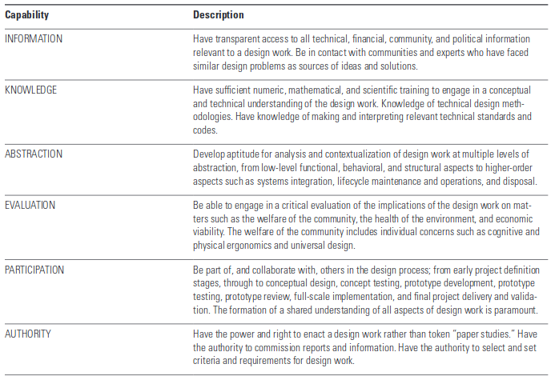

### Introduction

The Global Open Science Hardware (GOSH) community is an initiative gathering a highly diverse set of actors from academia, educators, entrepreneurs and non profit organizations with the common goal of making the designs of tools for science publicly available for everyone.

It is a “network of networks” which hosted its first gathering in 2016 at CERN in Geneva, Switzerland. Since its inception the topic gained greater visibility, received coverage in academic and non academic press, new mentorship programs were created, open-science hardware (OSH) projects have received funding and workshops are being run at universities’ labs.

This thesis tries to answer the question of how can open science hardware contribute to transform the knowledge production socio-technical system into a more democratic one. This is decomposed in the following set of questions:

1. How is GOSH established as a strategic innovation niche?
2. Who is and who is not participating in GOSH projects?
3. How do participants appropriate technology in GOSH projects?
4. How do people transform learnings into agency in GOSH projects?

I use a qualitative approach following the principles of grounded theory to analyze materials from participant observation, field notes, an exploratory survey and semi-structured interviews with members of projects belonging to GOSH. Using this material I will build two case studies, each one containing projects related to a specific sphere of application: academia and community science.

I consider this is a critical moment to understand GOSH as a movement and its potential contribution to science and technology democratization. After three years of global gatherings, the production of a community manifesto, a community roadmap and the multiplication of regional meetings, GOSH activities are now decentralizing. In what seems to be a tipping point, regional chapters are starting to develop OSH “residencies”, hosting local gatherings, and some of the initial members are working on policy recommendations. The previously blurry institutional interface is becoming sharper and new internal tensions and synergies emerge as the community chooses how to face the future.

### Analytic framework

#### For studying socio-technical change

The main research question (“how can open science hardware contribute to transform the knowledge socio-technical production system into a more democratic one?”) establishes the need of studying socio-technical change and how innovations come along. This is why I use the ‘Sociotechnical Transitions’ theory (Geels, 2002; Geels and Schot 2007a; Schot and Geels, 2008), sometimes called ‘Multilevel Perspective’ (MLP), as my main approach to research question _(a) “Can be GOSH considered a strategic innovation niche?”_

STT theory builds upon concepts from disciplines including history, evolutionary economics, institutional theory and STS. It’s a co-evolutionary approach, challenging overly linear explanations of change. Change is conceived as the product of an alignment and dealignment of factors at three different levels of crescent structure: niche, regime and landscape. 

The **niche** is the space where radical innovation happens. **Regime** refers to the  dominant  sociotechnical  system that the niche is potentially affecting or replacing; such regimes contain cognitive, regulative, and normative institutions (Geels, 2004). The **landscape** refers to exogenous  developments  or  shocks  (e.g.  economic  crises,  demographic  changes,  wars,  ideological  change,  major  environmental  disruption  like  climate  change)  that  create  pressures on the regime, which in turn create windows of opportunity for the diffusion of niche-innovations.

The timing and nature of interactions between the three levels of the MLP result in different kinds of alignments or **transitions pathways**, which have been typologized in the literature. Windows of opportunity can open up in the regime through pressures from the landscape, which niches need to be able to seize in order to survive and transform (or replace) the regime. 

According to MLP, in order to succeed niches should be able to articulate its expectations and visions in a robust and specific way, build deep and broad social networks, count with key intermediaries to exchange lessons and favour secondary learning in key areas, adapting their expectations and actions accordingly.

STT theory was originally conceived to study innovations within the marketplace, therefore it presents some limitations to study different forms of innovation like GOSH. Some authors have built upon STT concepts to address the particular case of innovation niches in bottom-up organisations of civil society, or **Grassroots Innovation Movements (GIM)**. 

GIM are collective forms of civil society seeking for socio-technical change through the development of new or alternative forms of material culture (Hess, 2005); they are political actors who develop alternative strategies of knowledge and technology production. GIM framework elaborates on the STT theory by combining it with concepts from social movements literature.

In this work I consider GOSH as a GIM because: 

1. its practitioners comprise a diverse set of actors from civil society including NGOs, independent scholars, entrepreneurs, scientists and teachers, networks and communities of practice acting as a collective, in different ways than institutions do; 
2. its focus on non-proprietary forms of knowledge and technology production involves a wide spectrum of actors into learning processes and exploring alternative scenarios for science; 
3. it poses a claim for social change, opening up the discussion about the direction of development and the roles of scientific research and technological change in society; and 
4. it recognizes itself as a movement.

Therefore I will analyze GOSH as a grassroots innovation movement contesting the current regime of closed, patented production of scientific tools, by using the following categories proposed by the GIM framework:

- **Framings**: The shared meanings, interpretations and narratives that hold GOSH together and orientate its activities, focusing on motivations, _problematization_ processes and _visions_. How the multiple framings within GOSH interact and evolve and develop in response to different periods of mobilization

- **Spaces and strategies**: the sites and arenas —physical, institutional, organizational and cognitive— where GOSH opens up material activity; and which strategies GOSH develops to achieve this in terms of:

    i) the ability to create broad and deep _networks_ and count with _key intermediaries_ for communicating, coordinating, representing and sharing their activities and lessons to a wider audience;

    ii) the repertoires of action or _forms of organization _and activism developed by the collective to gain access to spaces and challenge opponents (Tilly, 2008) which in GIM are tightly related to knowledge and technology production processes;

    iii) the _mobilization of resources_ (McCarthyand Zald, 1977), either material (financial, goods and services) or non-material (leadership, trust, skills, shared culture, historical tradition, ideology) in order to pursue the collective goals (Oberschall,1973).

- **Context**: the historical circumstances in which GOSH emerges, the issues and situations that are generative for the movement and the opportunities available within those contexts.

- **Pathways**: the development of GOSH over time, both in discursive terms (the fate and influence of its ideas and aims) and in material terms (the creation of new artefacts and new development trajectories).

#### For understanding democratization of technology

The innovation GOSH is bringing up -opening the tools for knowledge production to everyone-, implies in its essence a change in power distribution. By opening the designs of science tools, GOSH activists aim to be able to inscribe their own meanings, goals and values in technology, to use it for their own needs. It’s about scientists who want to be able to control their experiments, communities aiming to produce knowledge about their own problems, or educators who want to be able to open technology for students to meaningfully learn about how it works. 

Although “democratization” can host a wide diversity of meanings, interpretations and assumptions according to authors, disciplines and hypes, I will frame my analysis with concepts from the critical theory of technology (CTT) (Feenberg, 1999). Elaborating upon social constructivism of technology and concepts from Actor-Network Theory, CTT is concerned with the threat technocracy poses to the reflective capacities or agency people should have to critically evaluate technology.  

Technology is here considered an exercise of power, realized through designs that narrow the range of interests and concerns that are represented in it. The aim is therefore to democratize it: a democratic transformation of technology would open it to redesign for a wider range of interests and concerns (Feenberg, 1999) exposing the social in technologies (Sclove, 1995). 

Building up on these concepts, more recently Smith and Stirling (2018) define innovation democracy as “t_he access by the least powerful people and communities to the capacities for challenging the directions of the innovations that affect them”_. Democracy is understood here as a process rather than an endpoint, beyond formal notions of representative democracy or direct democracy (Shapiro & Hacker-Cordon, 1999). 

The authors identify four ways in which GIM contribute to democracy: (i) cultivating the more democratic practice of innovation more generally, (ii) supporting citizens and activities in ways that can contribute to the practice of democracy, (iii) creating particular empowering sociotechnical configurations that might otherwise be suppressed by interests around more mainstream innovation systems and (iv) nurturing general levels of social diversity that are important for the health of democracy in its widest political senses.

It’s considering these theoretical concepts that I address the rest of the research questions:

1. Who is and who is not participating in GOSH projects? (or who are ‘the least powerful’)
2. How do participants appropriate technology in GOSH projects?
3. How do people transform learnings into agency in GOSH projects?

##### Who participates

To operationalize (B) it is necessary to take a look at feminist technoscience studies. Feminist scholars have long identified the socially-constructed character of technology, and how it is both source and consequence of gender power relations (Wajcman, 2004), with early works on the deconstruction of the user/designer divide (Cowan, 1987) and the exclusion of specific groups of users from technology. By the late 1980s second-wave feminism had transformed itself in response to sustained critiques from black feminism, queer theory, post-modernism and post-colonial theory, producing numerous studies of technoscience. 

In particular for the case of technology design, design justice theory (DJT) (Costanza-Chock, 2018) understands that single-axis evaluations of fairness erase certain groups of people: specifically, those who are intersectionally disadvantaged[^1]. Costanza-Chock proposes to **analyze participation and power through all the design stages**, to understand which groups are being omitted and which favoured. This approach therefore requires to ask who participates in the design stage, who is the design for, whose values are embedded in design, who defines the scope, where is design developed, who owns the profits of design outcomes, which are the social relationships reproduced and whose stories are told about designs. 

This turns the intersectional analysis of participation and power into a dynamic tool, useful for analyzing how projects and initiatives change over time or react to external changes. It is also useful to compare patterns between initiatives with different application domains or developed in different contexts, which is an important feature of GOSH projects.

##### How they participate

To address (C) I refer to Domestication theory (DT) (Silverstone, Lie, Sorenson, etc), or the study of appropriation of artifacts (Silverstone & Hirsch, 1992). Metaphorically, this concept conveys the need to “tame” facts and artifacts that are taken from a “wild” outside world and put into a domestic setting. To domesticate an artifact is to negotiate its meaning and practice in a dynamic, interactive manner (Sorenson et al, 2000).

Domestication is a multidimensional process in which the artifact must be acquired (bought or made accessible in some other way), placed (that is, put in physical space as well as in mental space), interpreted (in the sense that it is given meaning within the local context, and given symbolic value to the outside world), and integrated into social practices of action.

Strategies of domestication take place in three main dimensions: 

(a) practical work: pattern of usage, how shall the artifact be employed

(b) symbolic work: production of meaning and the relationship between meaning, identity, and the public presentation of self. 

(c) cognitive work: learning processes, what kind of competences are needed and created in the appropriation process

This approach, within the sphere of cultural and media studies, emphasizes the complex cultural dynamics in which users appropriate technologies (Oudshoorn). It blurs the distinction between production and consumption: design and domestication are “the two sides of the innovation coin” (Lie and Sørensen 1996). 

The highly situated and contingent nature of Domestication Theory turns it useful to analyze how projects using Open Science Hardware develop differently according to different settings, motorizing different strategies. The identification of practical, symbolic and cognitive work allows to identify clearly which strategies work in which contexts and how workload is distributed within initiatives. Its focus on users also makes it appropriate for OSH, where the limits between developers and users are intentionally blurred and tools are given new, different uses and meanings.

##### Transforming learning into agency

Finally to address (D) or if people can effectively acquire the ability to question technology through OSH practices, I refer to the capability approach (CA) (Sen 1992, 1999, 2009, Nussbaum 2000, 2006, 2011). The CA has been highly influential in the area of justice, equality, well-being and development. It proposes an evaluation framework focused on _capabilities_: what people are effectively able to do and be, or the positive freedoms that people have to enjoy valuable ‘beings and doings’.

These beings and doings are called _functionings_ by Sen. The  distinction  between  achieved  functionings and capabilities is between the realized and the effectively possible (Robeyns, 2005). What is ultimately important is that people have the freedoms or valuable opportunities (capabilities) to lead the kind of lives they want to lead, to do what they want to do and be the person they want to be. Sen calls this “agency freedom”, and he argues it is a core ingredient of positive social change which may be exercised at the individual level or in groups, through democratic participation.

One of the crucial insights of the capability approach is that the conversion of goods, services, social institutions or practices (means) into functionings is influenced by _personal, social, and environmental conversion factors_. All bicycle owners are equal in terms of their possession of this resource, but people with certain disabilities will not gain an increased capability to move as a result of it (Sen 1983, 1985). This is why it’s convenient to focus on capabilities instead of available resources when evaluating programs, practices or policies. 

In the realm of design studies, Dong (2008) and Nichols and Dong (2012) propose to reconceptualize design through the CA. They understand the _capability to desig_n as key to many of the central capabilities categorized by Nussbaum (2000), taking the definition of design as “_opening a space for self-determination, and that means ensuring room for a project of one’s accord_” (Bonsiepe 2006). Furthermore, Dong provides a list of functionings associated to it, or “capability set” (Fig 1). 

As the capability approach aims to measure the sets of capabilities available to people, rather than the things people do, the authors base their evaluation on the supposition that individuals and communities may want to attain the capability to design their physical environment, even if they would never do it in practice. 

To measure the degree in which each functioning is achieved, Dong et al propose to look at pre-conditions (independent of the evaluated object) and operational conditions (directly dependant on the evaluated object), and assess the:

1. Existence of choice (e.g., can citizens choose to participate, choose to have knowledge about designing)
2. Use of choice (e.g., do citizens participate, do citizens make use of their knowledge of design)
3. Achievement of choice (e.g., what is the quality of participation, what are the outcomes of having knowledge of design)

    
Fig: Capability set for capability to design (Dong, 2008)

If we consider the definitions of technology democratization mentioned in the beginning of this section: 

*   “a democratic transformation of technology would open it to redesign for a wider range of interests and concerns” (Feenberg, 1999) and 
*   “the access by the least powerful people and communities to the capacities for challenging the directions of the innovations that affect them” (Smith and Stirling, 2018)

The CA applied to design, or “capability to design” turns out to be a useful framework for assessing how OSH can democratize technology in these terms. However, as we are talking about democratization of tools _for science_, there are some dimensions that the design capability set may not be capturing. Alkire (2002) has applied the capability approach to study small projects with a participatory approach, mentioning that letting subjects define the set of capabilities to analyze is key for this kind of studies. For this reason I will complement these identified functionings with those emerging from the analysis of community documentation (reports from gatherings, deliberation processes, roadmap, manifesto) and my personal field notes.

#### Transitions towards democratization

In the previous sections I have dissected the research questions that constitute the backbone of this thesis, and related each of them to a particular framework for analysis. In this section I compose these views into a framework for studying the case of OSH as a transition towards a more democratic science and tech socio-technical system. 

Being the CA a normative evaluation tool, underspecified and non-explanatory, every author advocates for its combination with other frameworks to make it operational (Roybens, 2005). In technology and design, Zheng and Stahl (2011) propose combining the CA with the Critical Theory to look at issues of power; other authors propose combining it with categories from Appropriate Technology and Science and Technology Studies (Oosterlaken et al, 2010), emphasizing the role of diversity in design. In a similar vein but changing the object, critics on Domestication Theory point out that domestication is not a process free of friction and resistance: gender, class, ethnicity, and age may be relevant analytical categories for framing and understanding it. 

Sovacool and Hess (2017) recently elaborated a review of the most valued theories in Science and Technology Studies. To guide research and order the field, they propose a typology of theories according to two axis of categorization: 

*   Axis 1: analytical strategies and areas of focal attention (agency, structure, meaning, relations, and norms)
*   Axis 2: under-lying groups of underlying assumptions and goals (functionalist-institutional, culturalist-interpretivist, critical-humanist, and conflict). 

The authors suggest that deeper understanding may emerge only when different theoretical perspectives are analyzed and juxtaposed. I will start describing how I’m combining approaches in terms of both axis and how this determines the temporal scale and level of analysis.

In the first axis, the combination of DJT, DT and CA centers the analysis on agency at the individual or project level, turning the ideas of the CTT operational. However, agency-oriented strategies can assume that people are atomistic agents whose action can be explained without deep consideration of structure (Jackson, 2005). This is avoided by framing these questions within the STT, a relational approach, and the GIM framework in particular. In this way the analysis gains an important structural and meaning component. In return, it also complements STT in an aim to counterbalance the downplay on agency and politics brought to attention by its critics. Another important observation is that the CA, besides its focus on agency, is a normative type of theory attempting to answer whether a certain innovation is a net positive or negative for society and individuals, differently from all the other descriptive theories.

In the second axis, Sovacool & Hess consider DT is an interpretivist theory, aimed to generate thick descriptions, insights and explanations of the complex models of and for action that people share, reproduce, perform, contest and modify. The combination of DT with STT and CTT, which fall into critical-humanist approaches, complement this vision with aspects of historical contingency and the potential for significant change and radical innovation.

The authors make a call to look at the missing theories in the list, with a special mention of feminist technoscience studies. In this aspect the incorporation of DJT and the concept of intersectionality, besides being instrumental, draws attention to a scholarship surprisingly omitted by the interviewed experts. 

In practical terms, combining the focus on diversity brought by DJT with the CA to Design is facilitated by a shared level of analysis (the individual) and a common underlying temporal scale: the stages of the design process and its outcomes. DT, with its focus on the other side of the coin, or how users appropriate technology, completes the picture. It provides insights on which is the practice developed by these users/creators, in their exercise or not of their capability to (re)design. Although it shares the individual level of analysis, it expands the temporal scale of the design process to include appropriation, providing a more complete view. 

As a result, in terms of level of analysis we move back and forth between an individual, community and systems perspective, providing insights on how they interact with each other and with other actors in the socio-technical system, in order to advance change. Regarding the spatial scale, again the approach is multi-scalar: although individuals and projects work at the local/regional scope, the collective works at the global level.

### Methods

An exploratory phase was performed through participatory observation and an online survey. Based on this information the design of the study will follow an embedded multiple-case scheme (Yin, 2018) in which the contexts are "academia" and "community science", with two open science hardware projects embedded as subunits of analysis in each context. 

The selection of projects is based on the following criteria: 
- accessibility to information
- developing activities in the global south
- active during the last year
- developed and tested at least one prototype
- diversity of participants in the project

Individual semi-structured interviews will be held with three participants of each selected project. Materials such as: online repositories, forum discussions, field notes from events, community documents and press articles will also be incorporated to the corpus. 
